# VulnChain — Mermaid Diagram Code

> **How to use in draw.io:**
> 1. Open draw.io → Extras → Edit Diagram
> 2. Delete existing content, paste the Mermaid code block (without the triple backticks)
> 3. Click OK — diagram renders
> 4. **Fix curvy lines:** Select all edges (Edit → Select Edges) → Format → Style → change `curved=1` to `curved=0`
> 5. Export as PNG (File → Export as → PNG, set scale to 2x for clarity)

> **A4 fit tip:** After importing, use File → Page Setup → A4 Portrait, then Ctrl+Shift+H (Fit Page) to auto-scale.

---

## 1. System Architecture Diagram (Fig 6.1)

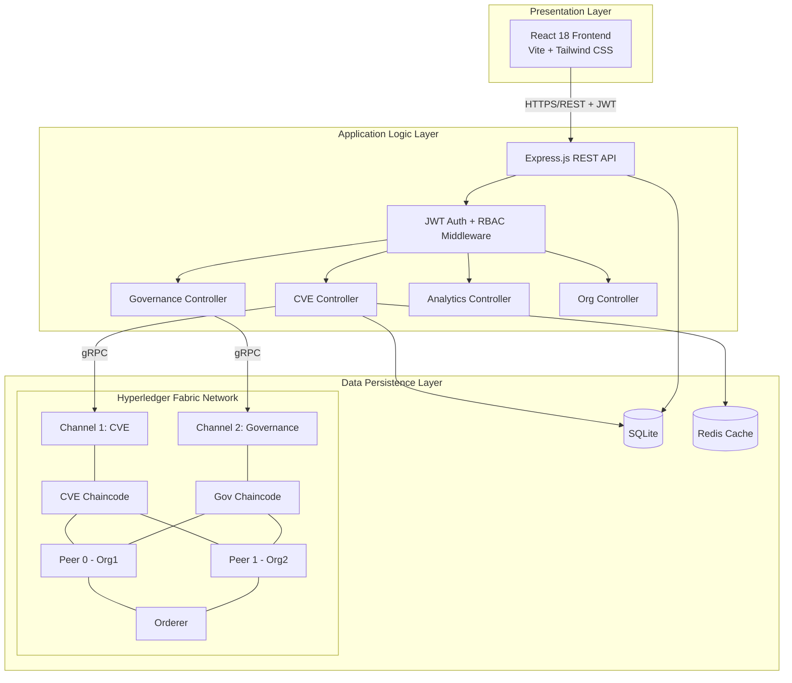

---

## 2. Use Case Diagram (Fig 6.2)
*Vertical layout, all 13 use cases, actors on left and right sides*

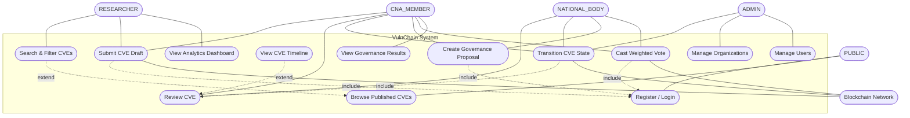

---

## 3. Class Diagram (Fig 6.3)

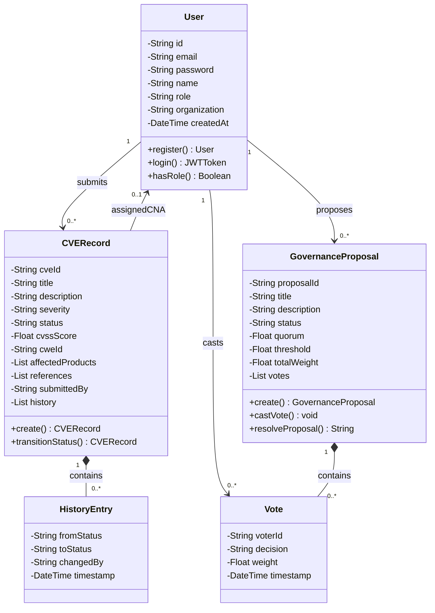

---

## 4. Sequence Diagram — CVE Submission (Fig 6.4)

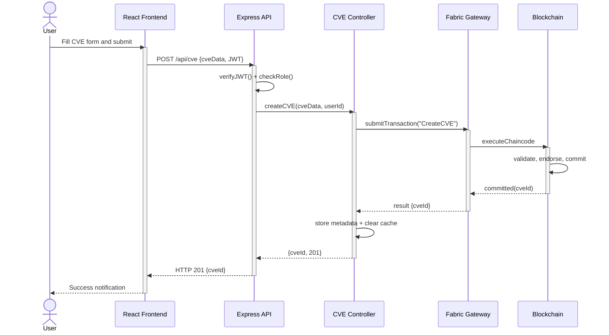

---

## 5. Sequence Diagram — Governance Voting (Fig 6.5)

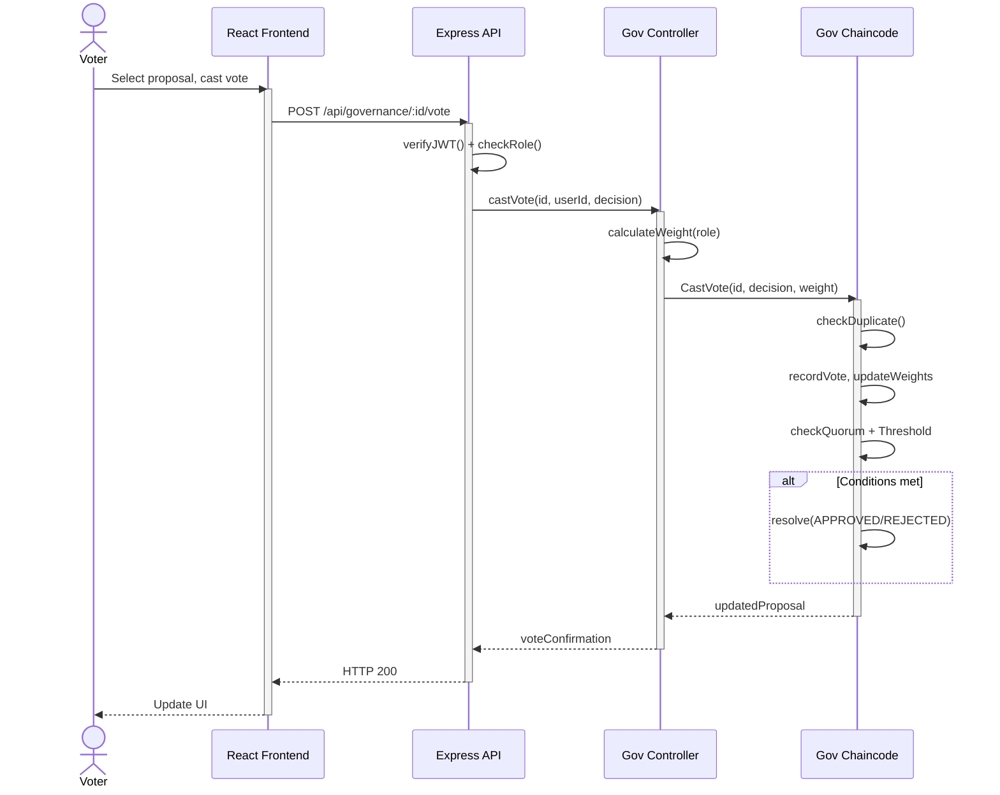

---

## 6. Activity Diagram — CVE Lifecycle (Fig 6.6)

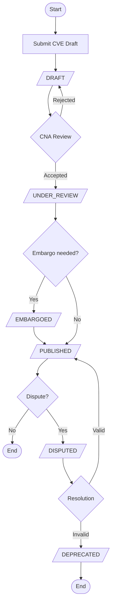

---

## 7. Activity Diagram — Governance Process (Fig 6.7)

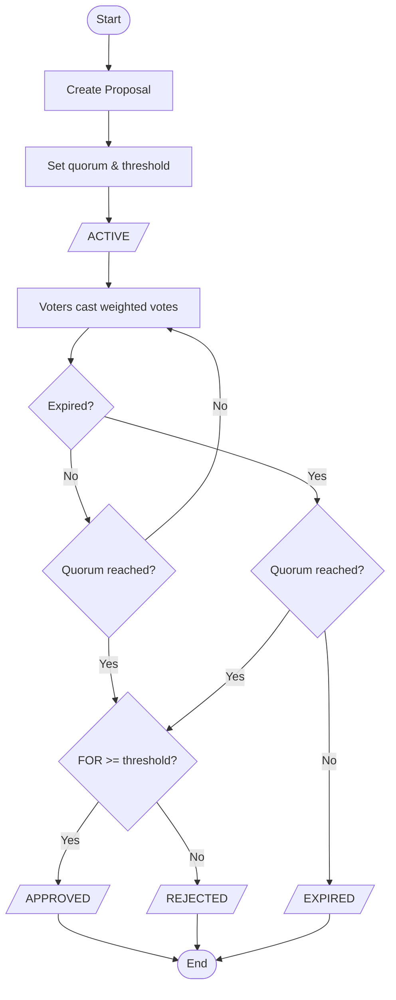

---

## 8. Level-0 DFD — Context Diagram (Fig 6.8)

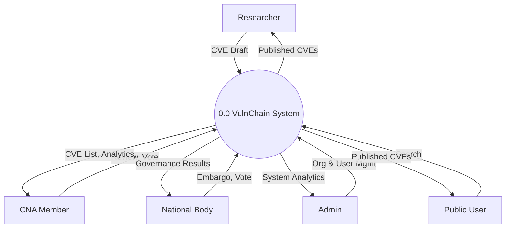

---

## 9. Level-1 DFD (Fig 6.9)

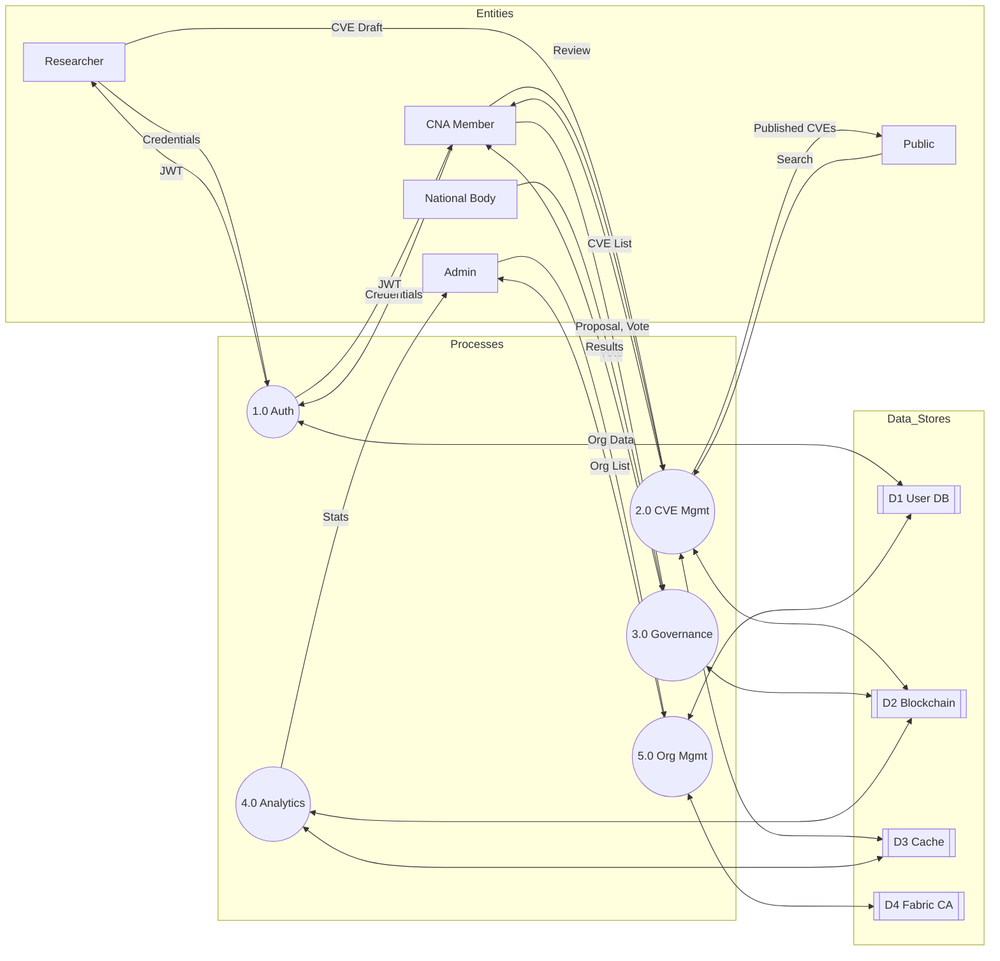

---

## 10. ER Diagram — Chen Notation (Fig 6.10)
*Structured top-down: entities in center row, attributes above/below, relationships between*

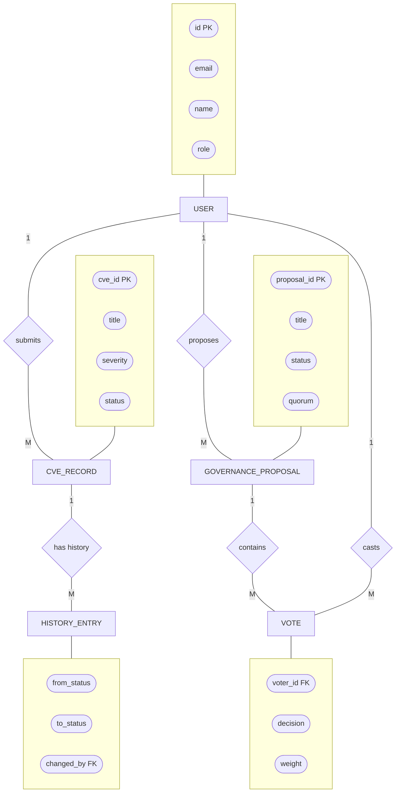

---

## 11. State Machine — CVE Lifecycle (Fig 5.1)

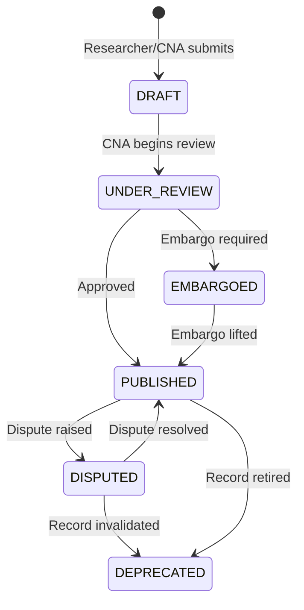

---

## Summary

| # | Diagram | Figure | A4 Orientation |
|---|---|---|---|
| 1 | System Architecture | Fig 6.1 | Portrait |
| 2 | Use Case (13 use cases) | Fig 6.2 | Portrait |
| 3 | Class Diagram | Fig 6.3 | Landscape or Portrait |
| 4 | Sequence — CVE Submission | Fig 6.4 | Portrait |
| 5 | Sequence — Governance Voting | Fig 6.5 | Portrait |
| 6 | Activity — CVE Lifecycle | Fig 6.6 | Portrait |
| 7 | Activity — Governance | Fig 6.7 | Portrait |
| 8 | DFD Level-0 (Context) | Fig 6.8 | Portrait |
| 9 | DFD Level-1 | Fig 6.9 | Landscape |
| 10 | ER Diagram (Chen) | Fig 6.10 | Landscape |
| 11 | State Machine | Fig 5.1 | Portrait |

> **After importing each diagram in draw.io:**
> 1. Select all → Format → Style → set `curved=0` for straight lines
> 2. Ctrl+Shift+H to fit to page
> 3. Manually adjust positions if needed for cleaner layout
> 4. Export as PNG at 2x scale for print quality
