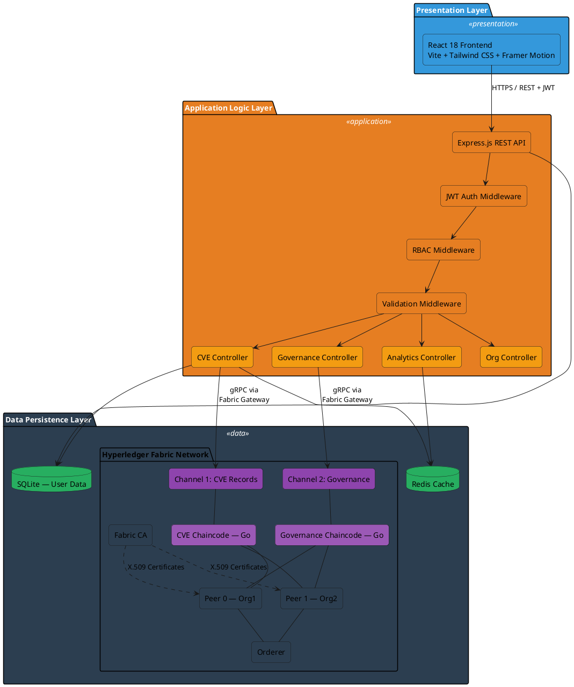
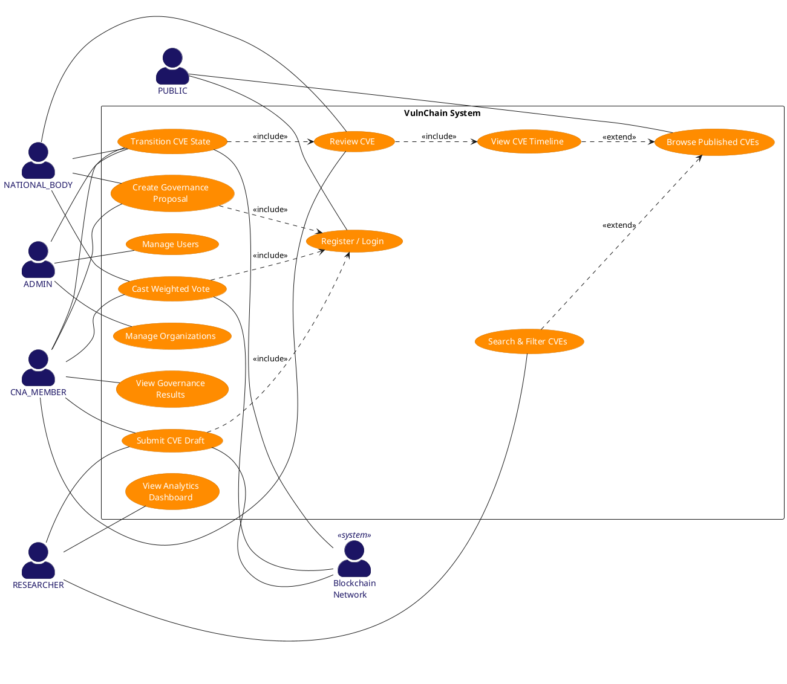
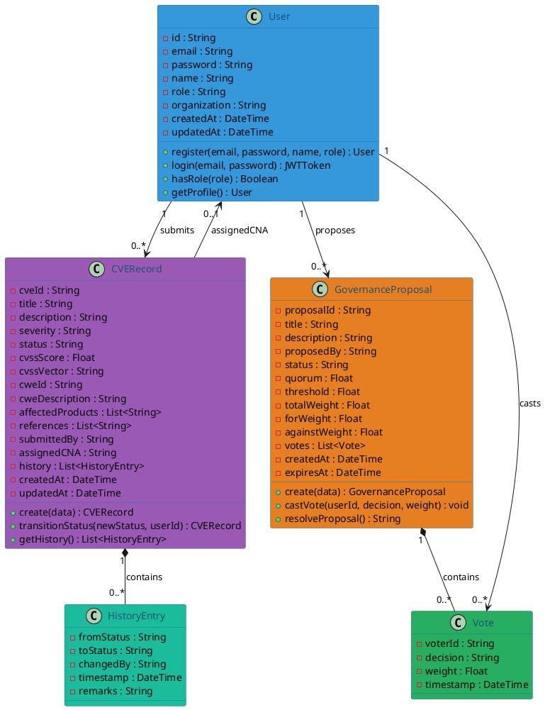
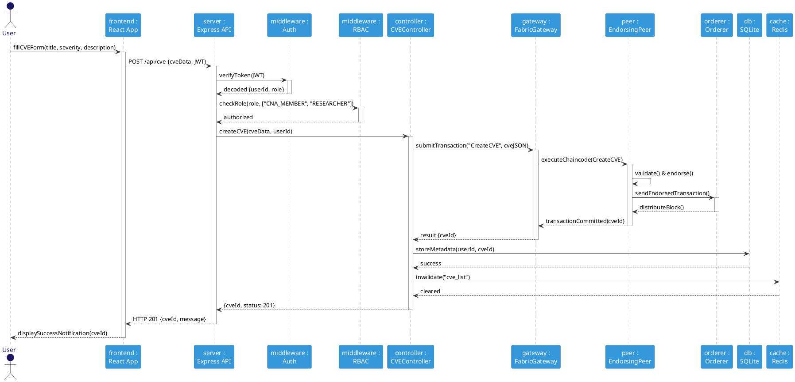
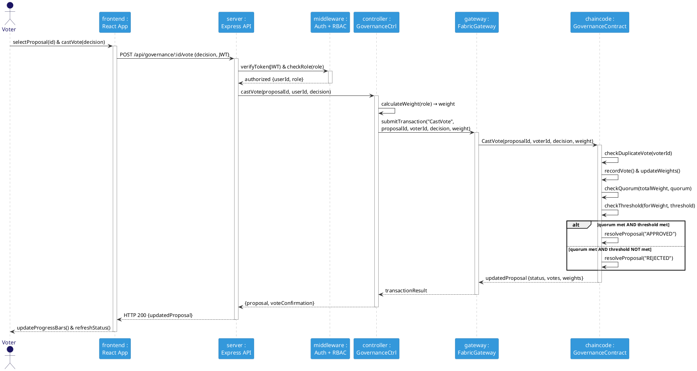
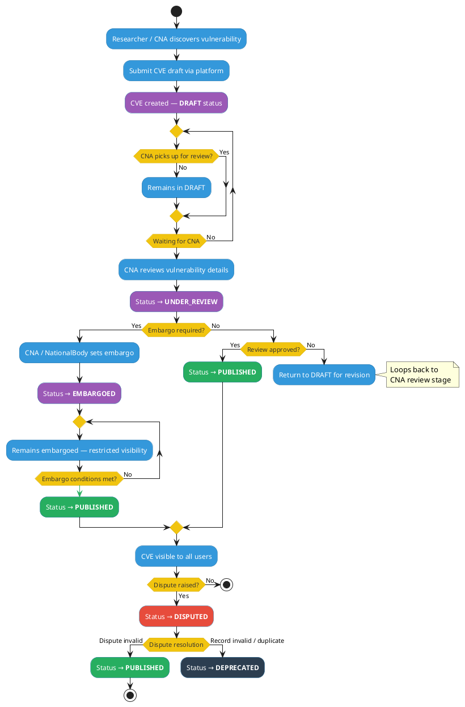
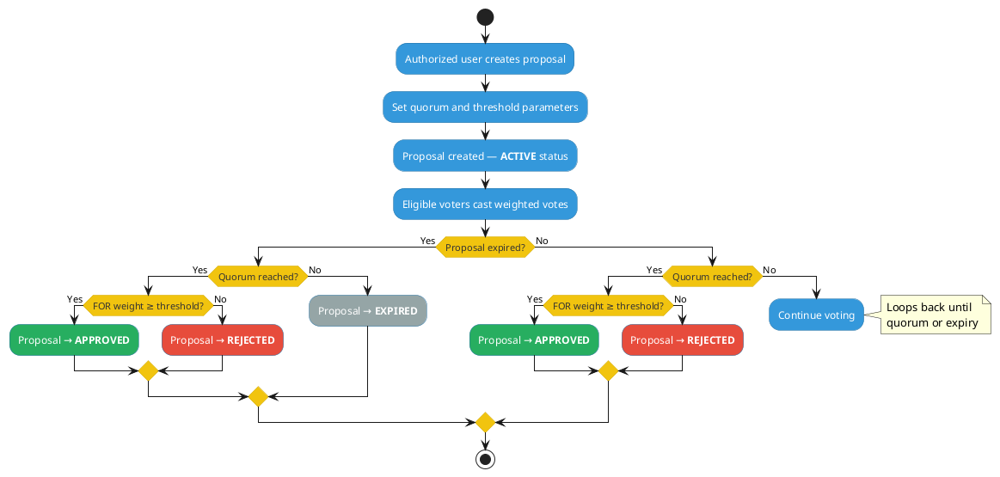
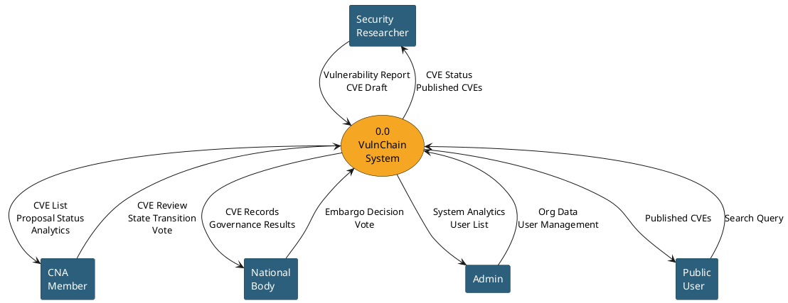
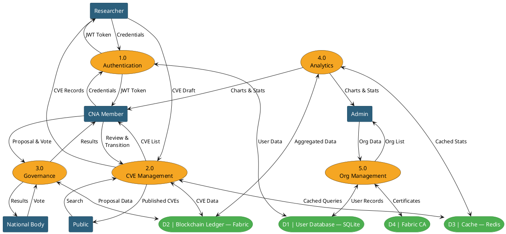
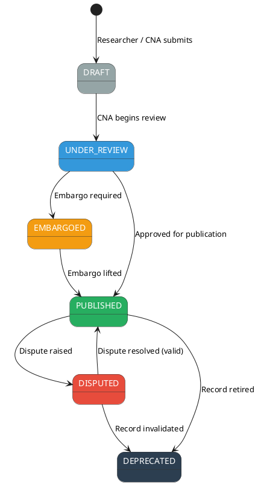

# VulnChain — PlantUML Diagram Code for draw.io

> **NOTE:** The Mermaid code in `VulnChain_Project_Report.md` is the primary source. These PlantUML versions are an alternative if draw.io PlantUML import works better for your setup. The diagrams below may have more participants/detail than the simplified Mermaid versions.

> **How to use in draw.io:**
> 1. Open draw.io (app.diagrams.net)
> 2. Go to **Extras → Edit PlantUML** (or **Insert → Advanced → PlantUML**)
> 3. Paste the PlantUML code for the desired diagram
> 4. Click **Insert** — the diagram renders automatically
> 5. Export as PNG/SVG and insert into the report

---

## 1. System Architecture Diagram (Fig 6.1)



---

## 2. Use Case Diagram (Fig 6.2)



---

## 3. Class Diagram (Fig 6.3)



---

## 4. Sequence Diagram — CVE Submission (Fig 6.4)



---

## 5. Sequence Diagram — Governance Voting (Fig 6.5)



---

## 6. Activity Diagram — CVE Lifecycle (Fig 6.6)



---

## 7. Activity Diagram — Governance Process (Fig 6.7)



---

## 8. Level-0 DFD — Context Diagram (Fig 6.8)



---

## 9. Level-1 DFD (Fig 6.9)



---

## 10. ER Diagram — Chen Notation (Fig 6.10)

```plantuml
@startuml ERDiagramChen
skinparam backgroundColor #FFFFFF
skinparam defaultFontName Arial

' ===== Styling =====
skinparam rectangle {
    BackgroundColor #3498DB
    FontColor #FFFFFF
    BorderColor #2471A3
}

skinparam usecase {
    BackgroundColor #EBF5FB
    FontColor #1A5276
    BorderColor #5DADE2
}

skinparam hexagon {
    BackgroundColor #E67E22
    FontColor #FFFFFF
    BorderColor #CA6F1E
}

' ===== USER Entity =====
rectangle "USER" as USER #3498DB

usecase "<u>id</u> (PK)" as u_id #FEF9E7
usecase "email" as u_email
usecase "name" as u_name
usecase "role" as u_role
usecase "organization" as u_org

USER -- u_id
USER -- u_email
USER -- u_name
USER -- u_role
USER -- u_org

' ===== CVE_RECORD Entity =====
rectangle "CVE_RECORD" as CVE #3498DB

usecase "<u>cve_id</u> (PK)" as c_id #FEF9E7
usecase "title" as c_title
usecase "severity" as c_sev
usecase "status" as c_stat
usecase "cvss_score" as c_cvss
usecase "cwe_id" as c_cwe

CVE -- c_id
CVE -- c_title
CVE -- c_sev
CVE -- c_stat
CVE -- c_cvss
CVE -- c_cwe

' ===== GOVERNANCE_PROPOSAL Entity =====
rectangle "GOVERNANCE_PROPOSAL" as GP #3498DB

usecase "<u>proposal_id</u> (PK)" as g_id #FEF9E7
usecase "title " as g_title
usecase "status " as g_stat
usecase "quorum" as g_quorum
usecase "threshold" as g_thresh

GP -- g_id
GP -- g_title
GP -- g_stat
GP -- g_quorum
GP -- g_thresh

' ===== HISTORY_ENTRY — Weak Entity =====
rectangle "HISTORY_ENTRY" as HE #85C1E9

usecase "from_status" as h_from
usecase "to_status" as h_to
usecase "changed_by (FK)" as h_by #E8F8F5
usecase "timestamp" as h_ts

HE -- h_from
HE -- h_to
HE -- h_by
HE -- h_ts

' ===== VOTE — Weak Entity =====
rectangle "VOTE" as VT #85C1E9

usecase "voter_id (FK)" as v_vid #E8F8F5
usecase "decision" as v_dec
usecase "weight" as v_wt
usecase "timestamp " as v_ts

VT -- v_vid
VT -- v_dec
VT -- v_wt
VT -- v_ts

' ===== Relationships (Diamond shapes) =====
diamond "submits" as R1 #E67E22
diamond "assigned\nas CNA" as R2 #E67E22
diamond "proposes" as R3 #E67E22
diamond "casts" as R4 #E67E22
diamond "has\nhistory" as R5 #E67E22
diamond "contains" as R6 #E67E22

USER -- "1" R1
R1 -- "M" CVE

USER -- "1" R2
R2 -- "0..M" CVE

USER -- "1" R3
R3 -- "M" GP

USER -- "1" R4
R4 -- "M" VT

CVE -- "1" R5
R5 -- "M" HE

GP -- "1" R6
R6 -- "M" VT
@enduml
```

---

## 11. State Machine Diagram — CVE Lifecycle (Fig 5.1)



---

## Summary — All Diagrams

| # | Diagram | PlantUML File Tag | Report Figure |
|---|---|---|---|
| 1 | System Architecture | `@startuml SystemArchitecture` | Fig 6.1 |
| 2 | Use Case | `@startuml UseCaseDiagram` | Fig 6.2 |
| 3 | Class | `@startuml ClassDiagram` | Fig 6.3 |
| 4 | Sequence — CVE Submission | `@startuml SequenceCVESubmission` | Fig 6.4 |
| 5 | Sequence — Governance Voting | `@startuml SequenceGovernanceVoting` | Fig 6.5 |
| 6 | Activity — CVE Lifecycle | `@startuml ActivityCVELifecycle` | Fig 6.6 |
| 7 | Activity — Governance Process | `@startuml ActivityGovernanceProcess` | Fig 6.7 |
| 8 | DFD Level-0 (Context) | `@startuml DFDContextDiagram` | Fig 6.8 |
| 9 | DFD Level-1 | `@startuml DFDLevel1` | Fig 6.9 |
| 10 | ER Diagram (Chen Notation) | `@startuml ERDiagramChen` | Fig 6.10 |
| 11 | State Machine — CVE Lifecycle | `@startuml StateMachineCVE` | Fig 5.1 |
