# VulnChain — Decentralized CVE Management Platform
## B.Tech 8th Semester Project Report

---

## COVER PAGE

**A Project Report On**

**"VulnChain — Decentralized CVE Management Platform Using Hyperledger Fabric"**

**(Major Project — CE451.01)**

[INSERT: Project Logo/Relevant Image — Use the VulnChain shield+chain logo or a blockchain security themed image]

**Prepared by**

Student Name (ID)

**Under the Supervision of**

Dr./Mr. Name of Internal Supervisor

**Submitted to**

Charotar University of Science & Technology (CHARUSAT)
for the Partial Fulfillment of the Requirements for the
Degree of Bachelor of Technology (B.Tech.)
in Computer Engineering (CE)
for 8th Semester

**Submitted at**

Accredited with Grade A+ by NAAC

DEPARTMENT OF COMPUTER ENGINEERING
Devang Patel Institute of Advance Technology and Research (DEPSTAR)
Faculty of Technology & Engineering (FTE), CHARUSAT
At: Changa, Dist: Anand, Pin: 388421.

**April, 2026**

---

## CANDIDATE'S DECLARATION

I hereby declare that the project report entitled **"VulnChain — Decentralized CVE Management Platform Using Hyperledger Fabric"**, submitted to Devang Patel Institute of Advanced Technology and Research (DEPSTAR), Changa, in partial fulfillment of the requirements for the award of the degree of Bachelor of Technology (B.Tech) in Computer Engineering, from the Department of Computer Engineering, DEPSTAR-FTE, CHARUSAT, is a record of the bonafide Major Project (CE451.01) work carried out by me under the guidance of [Name of Internal Guide].

I further declare that the work presented in this project report is original and has been carried out by me, and that this work has not been submitted previously, either in part or in full, for the award of any degree in this institute or in any other institute or university.

Student Name (ID)

---

## CERTIFICATE

Accredited with Grade A+ by NAAC

This is to certify that the report entitled **"VulnChain — Decentralized CVE Management Platform Using Hyperledger Fabric"** is a bonafide work carried out by **Student Name (ID No)** under the guidance and supervision of **Dr./Mr. Name of Internal Guide** for the subject MAJOR PROJECT (CE451.01) of 8th Semester of Bachelor of Technology in Computer Engineering at Devang Patel Institute of Advance Technology and Research (DEPSTAR), Faculty of Technology & Engineering (FTE) – CHARUSAT, Gujarat.

To the best of my knowledge and belief, this work embodies the work of the candidate himself/herself, has duly been completed, and fulfills the requirement of the ordinance relating to the B.Tech. Degree of the University and is up to the standard in respect of content, presentation and language for being referred by the examiner(s).

| | |
|---|---|
| Internal Guide Signature | Head of Department Signature |
| Name: | Name: |
| Date: | Date: |

Devang Patel Institute of Advance Technology and Research (DEPSTAR)
Faculty of Technology & Engineering (FTE), CHARUSAT
At: Changa, Ta. Petlad, Dist. Anand, Pin: 388421. Gujarat.

---

## ABSTRACT

The current CVE (Common Vulnerabilities and Exposures) management ecosystem relies on centralized authorities such as MITRE and NIST, which introduces single points of failure, lacks transparent audit trails, and suffers from delayed vulnerability disclosure processes. This project, VulnChain, addresses these challenges by implementing a decentralized CVE management platform built on Hyperledger Fabric, a permissioned blockchain framework.

VulnChain provides a comprehensive platform for submitting, reviewing, tracking, and governing CVE records through a multi-organization blockchain network. The system implements a robust CVE lifecycle state machine with six states — DRAFT, UNDER_REVIEW, EMBARGOED, PUBLISHED, DISPUTED, and DEPRECATED — controlled through role-based access for five distinct user roles: ADMIN, CNA_MEMBER, NATIONAL_BODY, RESEARCHER, and PUBLIC. A weighted governance mechanism allows authorized stakeholders to participate in democratic decision-making through proposals with configurable quorum and threshold parameters, ensuring that no single entity has unilateral control over critical decisions.

The platform architecture is divided into three primary layers. The first is the blockchain layer, which uses a Hyperledger Fabric network with two dedicated channels — one for CVE records and one for governance operations — with smart contracts written in Go. The second is the backend API layer, built with Node.js and Express, which handles authentication through JWT tokens, stores off-chain user data in SQLite, and uses Redis for caching frequently accessed records. The third layer is the frontend, a modern React-based dashboard built with Vite and Tailwind CSS, featuring a cybersecurity-themed dark interface with real-time analytics and interactive visualizations.

Key features include CVSS severity scoring, CWE weakness classification, organization management, detailed analytics dashboards, and a complete immutable audit trail maintained on the blockchain ledger. The project demonstrates how permissioned blockchain technology can meaningfully enhance transparency, accountability, and collaboration in the global vulnerability management process.

**Keywords:** Blockchain, Hyperledger Fabric, CVE, Vulnerability Management, Smart Contracts, Decentralized Governance, Cybersecurity

---

## ACKNOWLEDGEMENT

I would like to express my sincere gratitude to my project guide, **[Name of Internal Guide]**, for providing valuable guidance, encouragement, and support throughout the development of this project. Their expertise and constructive feedback played a crucial role in shaping this work.

I am grateful to the **Head of Department, Computer Engineering, DEPSTAR** for providing the necessary infrastructure and a conducive academic environment. I also extend my thanks to all faculty members of the Department of Computer Engineering for their encouragement and knowledge sharing.

I would like to thank **Charotar University of Science and Technology (CHARUSAT)** for providing the opportunity to undertake this major project as part of the B.Tech curriculum.

Finally, I express my heartfelt thanks to my family and friends for their constant motivation and moral support during the course of this project.

Student Name
ID: [Student ID]
Department of Computer Engineering
DEPSTAR, CHARUSAT

---

## TABLE OF CONTENTS

*(Generate automatically in DOCX using Insert > Table of Contents)*

Abstract ... iii
Acknowledgement ... iv
List of Figures ... vi
List of Tables ... viii
List of Abbreviations ... ix

Chapter 1    Introduction ... 1
    1.1    Project Summary ... 1
    1.2    Purpose ... 2
    1.3    Objective ... 3
    1.4    Scope ... 4

Chapter 2    Technology and Literature Review ... 6
    2.1    Blockchain Technology ... 6
    2.2    Hyperledger Fabric ... 7
    2.3    CVE Ecosystem ... 9
    2.4    Related Work ... 10
    2.5    Tools and Technologies Used ... 12

Chapter 3    Project Management ... 15
    3.1    Project Planning ... 15
    3.2    Project Development Approach and Justification ... 16
    3.3    Project Effort and Time Estimation ... 17
    3.4    Roles and Responsibilities ... 18
    3.5    Project Scheduling ... 19

Chapter 4    System Requirements Study ... 20
    4.1    User Characteristics ... 20
    4.2    Hardware and Software Requirements ... 21
    4.3    Assumptions and Dependencies ... 22

Chapter 5    System Analysis ... 23
    5.1    Study of Current System ... 23
    5.2    Problems and Weaknesses of Current System ... 24
    5.3    Requirements of New System ... 25
    5.4    Feasibility Study ... 28
    5.5    Activity/Process in New System ... 29
    5.6    Features of New System ... 30

Chapter 6    System Design ... 31
    6.1    System Architecture Diagram ... 31
    6.2    Use Case Diagram ... 33
    6.3    Class Diagram ... 34
    6.4    Sequence Diagram ... 36
    6.5    Activity Diagram ... 38
    6.6    Data Flow Diagram ... 40
    6.7    ER Diagram ... 42
    6.8    Database Design ... 43
    6.9    Access Control and Security ... 45

Chapter 7    Implementation ... 47
    7.1    Implementation Environment ... 47
    7.2    Module Description ... 48
    7.3    Coding Standards ... 50
    7.4    Screenshots ... 51

Chapter 8    Testing ... 55
    8.1    Testing Plan ... 55
    8.2    Testing Strategy ... 56
    8.3    Test Cases ... 57

Chapter 9    Conclusion and Discussion ... 60
    9.1    Self Analysis of Project Viabilities ... 60
    9.2    Problems Encountered and Possible Solutions ... 61
    9.3    Summary of Project Work ... 62
    9.4    Limitation and Future Enhancement ... 63

References ... 64
Bibliography ... 66

---

## LIST OF FIGURES

*(Generate automatically in DOCX using Insert > Table of Figures)*

Fig 1.1    Centralized vs Decentralized CVE Architecture ... 2
Fig 2.1    Blockchain Block Structure ... 6
Fig 2.2    Hyperledger Fabric Transaction Flow ... 8
Fig 2.3    CVE Lifecycle in Traditional System ... 9
Fig 3.1    Gantt Chart — Project Schedule ... 19
Fig 5.1    CVE Lifecycle State Machine ... 29
Fig 6.1    System Architecture Diagram ... 31
Fig 6.2    Use Case Diagram — VulnChain System ... 33
Fig 6.3    Class Diagram — System Entities ... 34
Fig 6.4    Sequence Diagram — CVE Submission Flow ... 36
Fig 6.5    Sequence Diagram — Governance Voting Flow ... 37
Fig 6.6    Activity Diagram — CVE Lifecycle ... 38
Fig 6.7    Activity Diagram — Governance Process ... 39
Fig 6.8    Level-0 DFD (Context Diagram) ... 40
Fig 6.9    Level-1 DFD ... 41
Fig 6.10   ER Diagram ... 42
Fig 7.1    Screenshot — Landing Page ... 51
Fig 7.2    Screenshot — Login Page ... 51
Fig 7.3    Screenshot — Dashboard ... 52
Fig 7.4    Screenshot — CVE List ... 52
Fig 7.5    Screenshot — CVE Detail ... 53
Fig 7.6    Screenshot — CVE Submit Form ... 53
Fig 7.7    Screenshot — Governance Page ... 54
Fig 7.8    Screenshot — Governance Detail ... 54
Fig 7.9    Screenshot — Analytics Page ... 54

---

## LIST OF TABLES

Table 2.1    Technologies Used ... 12
Table 2.2    Tools Used ... 13
Table 2.3    Libraries Used ... 14
Table 3.1    Project Effort and Time Estimation ... 17
Table 3.2    Roles and Responsibilities ... 18
Table 4.1    User Types and Characteristics ... 20
Table 4.2    Hardware Requirements ... 21
Table 4.3    Software Requirements ... 21
Table 5.1    Functional Requirements ... 25
Table 5.2    Non-Functional Requirements ... 27
Table 5.3    Comparison — Current vs Proposed System ... 30
Table 6.1    User Table Schema ... 43
Table 6.2    CVE Record Structure ... 44
Table 6.3    Governance Proposal Structure ... 44
Table 6.4    Role-Based Access Control Matrix ... 45
Table 8.1    Test Cases — Authentication Module ... 57
Table 8.2    Test Cases — CVE Management Module ... 58
Table 8.3    Test Cases — Governance Module ... 59

---

## LIST OF ABBREVIATIONS

| Abbreviation | Full Form |
|---|---|
| API | Application Programming Interface |
| CA | Certificate Authority |
| CNA | CVE Numbering Authority |
| CVE | Common Vulnerabilities and Exposures |
| CVSS | Common Vulnerability Scoring System |
| CWE | Common Weakness Enumeration |
| DFD | Data Flow Diagram |
| ER | Entity Relationship |
| gRPC | Google Remote Procedure Call |
| JWT | JSON Web Token |
| MSP | Membership Service Provider |
| NIST | National Institute of Standards and Technology |
| NVD | National Vulnerability Database |
| RBAC | Role-Based Access Control |
| REST | Representational State Transfer |
| SDLC | Software Development Life Cycle |
| UI | User Interface |
| UML | Unified Modeling Language |

---

## CHAPTER 1: INTRODUCTION

### 1.1 Project Summary

VulnChain is a decentralized CVE (Common Vulnerabilities and Exposures) management platform built on Hyperledger Fabric blockchain technology. The platform transforms the traditionally centralized vulnerability disclosure process into a transparent, auditable, and collaborative system governed by multiple stakeholders rather than a single central authority.

The CVE system serves as the global standard for identifying and cataloging publicly known security vulnerabilities, relied upon by every major software vendor, security researcher, and government agency. However, the current CVE infrastructure is managed centrally by MITRE Corporation, creating risks related to availability, transparency, and trust that VulnChain aims to address. These problems are analyzed in detail in Chapter 5.

VulnChain enables security researchers, CNAs, and national cybersecurity bodies to collaboratively manage the entire CVE lifecycle — from draft submission through review, embargo, publication, and dispute resolution — with every action permanently recorded on the blockchain. The system also introduces a democratic governance layer where critical decisions are made through weighted voting among stakeholders.

### 1.2 Purpose

The purpose of this project is to address five fundamental limitations in the current centralized CVE management infrastructure (analyzed in detail in Section 5.2):

➤ **Eliminating Single Points of Failure** — distributing CVE management across multiple organizations on a blockchain network so that no single entity's operational issues can halt the vulnerability management process.

➤ **Establishing Transparent Audit Trails** — leveraging blockchain immutability to create permanent, cryptographically secured records of every state change, replacing the current opaque database-backed system.

➤ **Reducing Disclosure Delays** — enabling parallel processing of vulnerability records across multiple authorized CNAs rather than funneling everything through a centralized review pipeline.

➤ **Introducing Democratic Governance** — providing a weighted voting system where authorized participants can collectively make decisions about vulnerability management policies and dispute resolution.

➤ **Building Institutional Trust** — replacing the trust-based model (where stakeholders must trust the central authority) with a verify-based model where any participant can independently validate record integrity through blockchain cryptographic guarantees.

### 1.3 Objective

➤ Design and deploy a permissioned Hyperledger Fabric blockchain network with multiple organizations and two channels (CVE records and governance) for data segregation.

➤ Develop Go chaincode enforcing the complete CVE lifecycle state machine (DRAFT → UNDER_REVIEW → EMBARGOED → PUBLISHED → DISPUTED → DEPRECATED) with role-based transition rules.

➤ Implement a weighted governance mechanism with proposals, role-weighted voting, and automatic resolution based on configurable quorum and threshold parameters.

➤ Build a secure Node.js/Express REST API with JWT authentication, five-tier RBAC, SQLite for off-chain user data, and Redis caching for blockchain query performance.

➤ Create a responsive React frontend dashboard with Vite and Tailwind CSS featuring cybersecurity-themed dark UI, real-time analytics, and role-adaptive views.

➤ Integrate CVSS severity scoring and CWE weakness classification for standardized vulnerability assessment.

### 1.4 Scope

**What the system includes:**

➤ Multi-organization Hyperledger Fabric blockchain network deployable via Bevel (Kubernetes) or Docker Compose (local development).

➤ Complete CVE lifecycle management with enforced state transitions and immutable audit trail.

➤ Five-tier RBAC governing all platform features (detailed in Section 4.1 and Table 6.4).

➤ Weighted governance voting with proposals, quorum/threshold parameters, and automatic resolution.

➤ Real-time analytics dashboard with severity, status, trend, and organization visualizations.

➤ JWT-based authentication with bcrypt password hashing and automatic session management.

**What the system does not include:**

➤ Automated vulnerability scanning or detection — VulnChain manages records of already-identified vulnerabilities.

➤ Integration with MITRE's CVE Services or NIST's NVD for automated data synchronization.

➤ Automated CVSS score calculation from base metric inputs — only manual preliminary scoring by CNAs.

➤ Real-time notifications (email, SMS, Slack, webhooks) for state changes.

➤ Mobile-native applications (the responsive web frontend works on mobile browsers).

---

## CHAPTER 2: TECHNOLOGY AND LITERATURE REVIEW

### 2.1 Blockchain Technology

Blockchain is a distributed ledger technology that enables multiple independent parties to maintain a shared, synchronized record of data without requiring a central coordinating authority. The fundamental concept is straightforward: transactions are grouped into blocks, each block contains a cryptographic hash of the previous block, and this chaining mechanism makes it computationally infeasible to alter any historical record without invalidating every subsequent block in the chain.

The technology was first introduced in 2008 by Satoshi Nakamoto as the foundation for Bitcoin, a peer-to-peer electronic cash system. Since then, blockchain has evolved far beyond cryptocurrency into a general-purpose platform for building applications that require trust, transparency, and immutability. Industries ranging from supply chain management to healthcare records to financial services have adopted blockchain to solve problems where multiple parties need to share data but cannot or should not rely on a single trusted intermediary.

Blockchain networks are broadly categorized into three types based on their access model. Public blockchains like Ethereum and Bitcoin are open to anyone — any person can join the network, submit transactions, and participate in consensus. While this openness is valuable for cryptocurrency, it introduces challenges for enterprise applications: transactions are slow (limited to a few per second), every participant can see all data (problematic for sensitive information), and the consensus mechanisms consume significant computational resources. Private or permissioned blockchains restrict participation to known, authorized entities. Only approved organizations can operate nodes, submit transactions, and read ledger data. This model sacrifices the radical openness of public blockchains in exchange for dramatically higher transaction throughput, data privacy controls, and energy efficiency — making it far more suitable for enterprise use cases like CVE management. Consortium blockchains represent a middle ground where a defined group of organizations jointly govern the network, which is the model adopted by VulnChain.

For the VulnChain platform, the key blockchain properties being leveraged are immutability (ensuring that once a CVE record or state transition is written to the ledger, it cannot be altered or deleted), transparency (allowing any authorized network participant to independently verify the complete history of any record), and distributed consensus (ensuring that all organizations in the network agree on the current state of every vulnerability record before it is committed to the ledger).

### 2.2 Hyperledger Fabric

Hyperledger Fabric is an open-source, enterprise-grade, permissioned blockchain framework hosted by the Linux Foundation as part of the Hyperledger project family. It was specifically designed for building business applications where the participants are known to each other and need fine-grained control over data visibility and transaction processing. Fabric was selected as the blockchain platform for VulnChain after careful evaluation against alternatives, based on several distinguishing characteristics.

The first major advantage is Fabric's modular architecture. Unlike monolithic blockchain platforms where all components are tightly coupled, Fabric allows developers to plug in different implementations for consensus mechanisms, membership services, and ledger storage. This means the platform can be configured to match the specific performance and security requirements of different use cases rather than forcing a one-size-fits-all approach.

The second critical feature is channel-based data segregation. Fabric supports the creation of multiple independent channels within the same network, where each channel maintains its own separate ledger. VulnChain takes advantage of this by creating two channels — the CVE channel handles all vulnerability record operations (creation, updates, state transitions), while the governance channel manages proposals and voting. This separation ensures that governance operations do not interfere with CVE processing performance, and that access policies can be configured independently for each type of data.

Third, Fabric implements business logic through chaincode, which is equivalent to smart contracts in other blockchain platforms. Chaincode runs in isolated containers on endorsing peers and has full access to the ledger state. VulnChain deploys two chaincodes — a CVE contract that implements the vulnerability lifecycle state machine and enforces role-based transition rules, and a governance contract that manages proposal creation, vote collection, weight calculation, and automatic proposal resolution.

Fourth, Fabric provides enterprise-grade identity management through its Membership Service Provider (MSP). Every user and organization is issued X.509 digital certificates by a Fabric Certificate Authority, and these certificates are used to authenticate and authorize every transaction. This ensures that the identity of every participant who creates a CVE, transitions its state, or casts a governance vote is cryptographically verified and recorded.

Additionally, VulnChain utilizes Hyperledger Bevel (formerly known as the Blockchain Automation Framework) to automate the deployment of the Fabric network on Kubernetes clusters. Bevel uses Ansible playbooks and Helm charts to provision peers, orderers, certificate authorities, and channels with minimal manual intervention, significantly reducing the complexity of multi-organization network setup.

### 2.3 CVE Ecosystem

The CVE (Common Vulnerabilities and Exposures) system is the globally recognized framework for identifying, defining, and cataloging publicly known cybersecurity vulnerabilities. Understanding this ecosystem is essential context for appreciating the problems VulnChain aims to solve and the design decisions that shaped the platform.

At the center of the CVE ecosystem is MITRE Corporation, which has maintained the CVE List since 1999 under sponsorship from the U.S. Department of Homeland Security's Cybersecurity and Infrastructure Security Agency (CISA). MITRE acts as the primary CVE Numbering Authority (CNA) and coordinates the overall program. When a new vulnerability is discovered, a CNA assigns it a unique CVE identifier in the format CVE-YEAR-NNNNN (for example, CVE-2026-0001), writes a standardized description, and publishes it to the CVE List.

CVE Numbering Authorities are organizations that have been authorized by MITRE to assign CVE IDs within their defined scope. As of 2024, there are over 300 CNAs globally, including major technology companies (Microsoft, Google, Apple, Red Hat), security research organizations, and national cybersecurity agencies. Each CNA is responsible for vulnerabilities discovered in their own products or within their area of expertise.

Once a CVE is published, it is typically enriched by NIST's National Vulnerability Database (NVD) with additional analysis. This enrichment includes CVSS scores, which rate vulnerability severity on a 0.0 to 10.0 scale across five categories — NONE (0.0), LOW (0.1–3.9), MEDIUM (4.0–6.9), HIGH (7.0–8.9), and CRITICAL (9.0–10.0). The NVD also adds CWE (Common Weakness Enumeration) classifications that categorize the underlying software weakness type (such as CWE-79 for Cross-Site Scripting or CWE-89 for SQL Injection), along with CPE (Common Platform Enumeration) data identifying affected products and versions.

This ecosystem, while effective at scale, relies heavily on centralized infrastructure and trust in individual organizations, which creates the vulnerabilities that VulnChain addresses through decentralization.

### 2.4 Related Work

Several research efforts have explored the application of blockchain technology in cybersecurity contexts, providing both inspiration and lessons learned for VulnChain's design.

➤ **BlockCVE (2020):** This project proposed using Ethereum smart contracts for managing CVE records on a public blockchain. While the concept demonstrated the potential of blockchain for vulnerability management, it faced significant practical limitations. Transaction costs (gas fees) on Ethereum made every CVE operation expensive, the public nature of the chain prevented confidential vulnerability handling (critical for embargoed CVEs), and transaction throughput was limited to roughly 15 transactions per second — far too slow for a global vulnerability management system. VulnChain addresses all three limitations by using Hyperledger Fabric, which eliminates transaction fees, provides channel-based privacy controls, and supports thousands of transactions per second.

➤ **Decentralized Threat Intelligence Sharing Platforms (2019):** Research by Alexopoulos et al. explored using blockchain networks for sharing threat indicators (indicators of compromise, malware signatures) among organizations in a trustless manner. Their work validated that blockchain could effectively maintain shared security data across organizational boundaries, but their scope was limited to threat intelligence sharing and did not address the structured CVE lifecycle, state machine transitions, or governance mechanisms that VulnChain implements.

➤ **Hyperledger-Based Supply Chain Provenance Tracking (2021):** Several enterprise implementations, notably IBM Food Trust, demonstrated the viability of Hyperledger Fabric for tracking provenance and state transitions of items across multiple organizations in supply chains. These implementations provided architectural inspiration for VulnChain's multi-channel design and showed that Fabric's performance characteristics were well-suited for state tracking applications at enterprise scale.

➤ **Blockchain-Based Access Control Systems (2022):** Research into using blockchain for decentralized access control management informed VulnChain's approach to combining on-chain role validation (through chaincode) with off-chain authentication (through JWT tokens), creating a layered security model that is both secure and performant.

VulnChain differentiates itself from all prior work by providing a complete, end-to-end solution that encompasses the full CVE lifecycle with enforced state transitions, a democratic weighted governance mechanism, multi-channel data segregation, and a production-ready frontend dashboard — aspects that have not been combined in any previous implementation.

### 2.5 Tools and Technologies Used

#### 2.5.1 Technologies

**Table 2.1    Technologies Used**

| Technology | Version | Purpose |
|---|---|---|
| Hyperledger Fabric | 2.5 | The core permissioned blockchain platform providing the distributed ledger, consensus mechanism, and channel infrastructure for the decentralized CVE management network. |
| Go (Golang) | 1.21 | Used for developing the smart contracts (chaincode) that run on blockchain peers. Go was chosen for its strong typing, high performance, and first-class support in the Fabric chaincode SDK. |
| Node.js | 18.x LTS | The server-side JavaScript runtime powering the backend API. Selected for its non-blocking I/O model which handles concurrent API requests efficiently, and its extensive ecosystem of security-related packages. |
| Express.js | 4.18 | A minimal and flexible web application framework for Node.js that provides routing, middleware support, and request/response handling for the REST API layer. |
| React | 18.x | A component-based JavaScript library for building the frontend user interface. React's virtual DOM and component lifecycle make it well-suited for the dynamic, data-driven dashboard views required by VulnChain. |
| Vite | 5.x | A next-generation frontend build tool that provides near-instant hot module replacement during development and optimized production builds, significantly improving the development workflow compared to traditional bundlers. |
| Tailwind CSS | 3.x | A utility-first CSS framework that enables rapid UI development through composable utility classes. It was used to implement the custom dark cybersecurity theme consistently across all components. |
| SQLite | 3.x | A serverless, file-based relational database used for storing off-chain user data (credentials, profiles). Chosen for its zero-configuration setup and ACID compliance without requiring a separate database server. |
| Redis | 7.x | An in-memory data store used as a caching layer between the API and the blockchain. Frequently accessed CVE lists and analytics data are cached in Redis to reduce blockchain query load and improve response times. |
| Docker | 24.x | The containerization platform used to package and run all Fabric network components (peers, orderers, certificate authorities) as isolated containers with defined networking. |
| Kubernetes | 1.28 | A container orchestration platform used for production deployment of the Fabric network through Hyperledger Bevel, providing automated scaling, self-healing, and infrastructure management. |

#### 2.5.2 Tools

**Table 2.2    Tools Used**

| Tool | Purpose |
|---|---|
| Visual Studio Code | The primary integrated development environment used for all coding across Go, JavaScript, and configuration files, with extensions for ESLint, Prettier, and Go language support. |
| Git and GitHub | Version control system for tracking all code changes and collaboration, maintaining a complete history of the project's evolution across all three layers. |
| Postman | Used extensively for testing and documenting all REST API endpoints during development, creating organized collections for authentication, CVE, governance, and analytics routes. |
| Hyperledger Bevel | An automation framework that uses Ansible playbooks and Helm charts to deploy the complete Fabric network on Kubernetes, eliminating the need for manual multi-step network configuration. |
| Docker Compose | Used for local development environment orchestration, spinning up all Fabric network containers along with Redis with a single command. |
| draw.io | A diagramming tool used for creating all UML diagrams, system architecture diagrams, and data flow diagrams included in this report. |

#### 2.5.3 Libraries

**Table 2.3    Key Libraries Used**

| Library | Layer | Purpose |
|---|---|---|
| @hyperledger/fabric-gateway | Backend | Provides the Fabric Gateway client for connecting to peers, submitting transactions, and evaluating queries against chaincode through gRPC. |
| jsonwebtoken | Backend | Handles JWT token generation during login and token verification in the authentication middleware, supporting configurable expiration and custom claims. |
| bcryptjs | Backend | Provides secure password hashing with configurable salt rounds, ensuring that plain-text passwords are never stored in the database. |
| better-sqlite3 | Backend | A high-performance SQLite driver for Node.js that provides synchronous access to the database, used for all user data operations. |
| ioredis | Backend | A robust Redis client that handles connection pooling, automatic reconnection, and pipelining for the caching layer. |
| helmet | Backend | Automatically sets various HTTP security headers (Content-Security-Policy, X-Frame-Options, etc.) to protect the API against common web vulnerabilities. |
| express-validator | Backend | Provides declarative request validation and sanitization middleware, ensuring all incoming API data meets expected formats before processing. |
| react-router-dom | Frontend | Manages client-side routing with support for nested routes, route parameters, and protected route wrappers that enforce authentication. |
| axios | Frontend | An HTTP client configured with interceptors that automatically attach JWT tokens to outgoing requests and handle 401 responses by redirecting to login. |
| framer-motion | Frontend | Provides declarative animation components used for page transitions, element entrance animations, and interactive hover effects throughout the UI. |
| recharts | Frontend | A composable charting library built on React components, used to render the severity bar chart, status pie chart, and trends line chart in the analytics dashboard. |
| jwt-decode | Frontend | Decodes JWT tokens on the client side to extract user role, name, and organization claims without requiring a server round-trip, enabling immediate role-based UI rendering. |

---

## CHAPTER 3: PROJECT MANAGEMENT

### 3.1 Project Planning

The VulnChain project was planned and executed across the 8th semester (January 2026 — April 2026) in five sequential phases, each building upon the outputs of the previous phase. This phased approach was chosen to manage the complexity inherent in developing a multi-layered system that spans blockchain infrastructure, backend services, and frontend interfaces.

**Phase 1 — Research and Requirements Analysis (Weeks 1–2):** The project began with an extensive study of the existing CVE ecosystem, including how MITRE coordinates with CNAs, how the NVD enriches CVE records, and what specific pain points exist in the current centralized workflow. This was followed by an evaluation of blockchain platforms (Ethereum, Hyperledger Fabric, Hyperledger Sawtooth, Corda) against criteria including transaction throughput, data privacy controls, smart contract capabilities, and deployment tooling. Hyperledger Fabric was selected based on its channel-based privacy, modular architecture, and enterprise readiness. The phase concluded with detailed system requirements documentation and architecture design.

**Phase 2 — Blockchain Network and Chaincode Development (Weeks 3–5):** This phase focused on establishing the foundational blockchain infrastructure. The Hyperledger Fabric network was configured with multiple organizations, peers, an orderer node, and certificate authorities. Two channels were created for CVE and governance data segregation. The Go chaincode was developed iteratively — the CVE contract implementing the six-state lifecycle machine was written first, followed by the governance contract with weighted voting logic. Both chaincodes were tested extensively using Fabric's development mode before deployment to the network.

**Phase 3 — Backend API Development (Weeks 6–8):** With the blockchain layer operational, the REST API was built using Node.js and Express. The authentication system was implemented first (user registration, login, JWT token generation), followed by the RBAC middleware that validates user roles against endpoint permissions. The CVE controller was developed to interface with the Fabric Gateway SDK, submitting transactions and evaluating queries against the deployed chaincode. The governance and analytics controllers followed. SQLite was integrated for user data storage and Redis for caching frequently accessed blockchain data.

**Phase 4 — Frontend Development (Weeks 9–12):** The longest phase focused on building the complete React frontend. Development began with the project scaffolding (Vite configuration, Tailwind setup, authentication context), progressed through reusable UI components and the layout system with the collapsible sidebar, then moved to the major feature pages: Landing page with matrix animation, Dashboard with KPI cards and activity feed, CVE listing and detail pages, governance proposal and voting interfaces, and the analytics dashboard with interactive charts.

**Phase 5 — Integration Testing and Documentation (Weeks 13–14):** The final phase concentrated on end-to-end integration testing across all three layers, identifying and fixing bugs in data flow between the frontend and backend (such as API response format mismatches and chart rendering issues), performance optimization through Redis cache tuning, and preparation of this project report including all UML diagrams and documentation.

### 3.2 Project Development Approach and Justification

The project follows an **Agile (Iterative) development approach** combined with elements of the Spiral model for risk management.

The Agile methodology was chosen because VulnChain is a complex, multi-layered system where requirements and design decisions at one layer frequently influence other layers. For example, the structure of chaincode responses on the blockchain layer directly affects how the backend API parses data, which in turn determines the data format the frontend receives. An iterative approach allowed each layer to be developed, tested, and refined in short cycles before integrating with the next layer, catching interface mismatches early rather than during final integration.

The Spiral model's risk-driven approach was incorporated specifically because blockchain development carries inherent technical risks that are difficult to predict upfront. Network configuration issues, chaincode deployment failures, consensus problems, and Fabric SDK compatibility concerns all represented potential project blockers that needed to be identified and resolved early. By addressing the blockchain layer first (the highest-risk component) and validating its functionality before building dependent layers, the overall project risk was significantly reduced.

This combined approach proved effective in practice — when API response format mismatches were discovered during frontend integration (the backend returned nested objects where the frontend expected arrays), the iterative nature of the process allowed rapid identification and resolution without disrupting the overall timeline.

### 3.3 Project Effort and Time Estimation

**Table 3.1    Project Effort and Time Estimation**

| Phase | Tasks | Duration | Effort (Person-Hours) |
|---|---|---|---|
| Research & Requirements | Literature review, technology evaluation, requirements gathering, architecture design | 2 weeks | 40 |
| Blockchain Development | Fabric network setup, channel creation, CVE chaincode, governance chaincode, testing | 3 weeks | 75 |
| Backend API Development | Authentication, RBAC, CVE controller, governance controller, analytics, caching | 3 weeks | 70 |
| Frontend Development | UI components, layout, landing page, dashboard, CVE pages, governance, analytics | 4 weeks | 90 |
| Integration & Testing | End-to-end testing, bug fixing, performance tuning, documentation | 2 weeks | 45 |
| **Total** | | **14 weeks** | **320** |

### 3.4 Roles and Responsibilities

Since VulnChain is an individual major project, all roles were performed by the student developer. This required switching contexts between significantly different technology stacks and development paradigms.

**Table 3.2    Roles and Responsibilities**

| Role | Key Responsibilities |
|---|---|
| System Architect | Designed the three-tier architecture, decided on the two-channel strategy for data segregation, defined the CVE lifecycle state machine, and established the communication patterns between layers (REST for frontend-to-backend, gRPC for backend-to-blockchain). |
| Blockchain Developer | Wrote the Go chaincode for CVE and governance smart contracts, configured the Hyperledger Fabric network topology, managed digital certificates through Fabric CA, and set up Bevel configuration files for Kubernetes deployment. |
| Backend Developer | Built the Express.js REST API with all controllers and routes, implemented JWT authentication and RBAC middleware, designed the SQLite schema for user management, and integrated Redis caching with appropriate cache invalidation strategies. |
| Frontend Developer | Developed all React components and pages using Vite and Tailwind CSS, implemented the authentication context with JWT handling, built data visualization components with Recharts, and created the cybersecurity-themed dark UI with Framer Motion animations. |
| Tester | Designed and executed test cases across all modules, performed integration testing between layers, identified and resolved bugs in API response handling and UI rendering, and conducted security testing on authentication and authorization flows. |
| Technical Writer | Prepared this project report, created all UML diagrams, documented system architecture, and wrote user-facing help text within the application. |

### 3.5 Project Scheduling

[INSERT: Fig 3.1 — Gantt Chart]

*(Create a Gantt chart using Excel, ProjectLibre, or draw.io with the following task breakdown spanning January to April 2026:)*

| Task | Jan W1-W2 | Feb W3-W5 | Feb-Mar W6-W8 | Mar-Apr W9-W12 | Apr W13-W14 |
|---|---|---|---|---|---|
| Research & Requirements | ████ | | | | |
| Blockchain Development | | ████████ | | | |
| Backend API Development | | | ████████ | | |
| Frontend Development | | | | ████████████ | |
| Integration & Testing | | | | | ████ |
| Documentation & Report | | | | | ████ |

---

## CHAPTER 4: SYSTEM REQUIREMENTS STUDY

### 4.1 User Characteristics

VulnChain is designed to serve five distinct categories of users, each with different levels of cybersecurity expertise, different responsibilities within the vulnerability management ecosystem, and correspondingly different levels of access within the platform.

**Table 4.1    User Types and Characteristics**

| User Type | Description | Technical Level | System Access |
|---|---|---|---|
| ADMIN | System administrators who manage the VulnChain platform itself, including creating organizations, enrolling users, and overseeing all system operations. They typically have deep technical knowledge of both cybersecurity and the blockchain infrastructure. | Expert | Complete unrestricted access to all platform features, including user management, organization management, all CVE operations, governance participation, and full analytics. |
| CNA_MEMBER | Members of CVE Numbering Authority organizations who are directly responsible for vulnerability assessment. They submit new CVE records, review drafts from researchers, perform state transitions to move CVEs through the lifecycle, and participate actively in governance decisions with significant voting weight. | Advanced | CVE submission and full lifecycle management, governance proposal creation and voting, analytics access, and organization-scoped operations. |
| NATIONAL_BODY | Representatives of national cybersecurity organizations such as CERT teams and government cybersecurity agencies. They focus on overseeing vulnerability management at a national or regional level, managing embargo periods for sensitive vulnerabilities, and participating in governance with the highest voting weight reflecting their institutional authority. | Advanced | CVE review and embargo management, governance participation with elevated voting weight, full analytics access, but no direct CVE submission (they oversee rather than discover). |
| RESEARCHER | Independent security researchers and ethical hackers who discover vulnerabilities and need to report them through the platform. They can create CVE draft submissions with initial vulnerability details but cannot move records through the lifecycle — that responsibility belongs to CNAs and national bodies who validate the findings. | Intermediate | CVE draft submission, viewing published CVE records, limited analytics access, and read-only governance visibility. |
| PUBLIC | General users from the broader cybersecurity community who need access to published vulnerability information for patching, compliance, or awareness purposes. They have no management capabilities and can only consume information that has been formally published. | Basic | Read-only access to CVE records that have reached PUBLISHED status, and basic analytics views. |

### 4.2 Hardware and Software Requirements

**Table 4.2    Minimum Hardware Requirements**

| Component | Requirement | Justification |
|---|---|---|
| Processor | Intel Core i5 or equivalent (4 cores minimum) | Required to run multiple Docker containers for blockchain peers, orderer, and CA simultaneously alongside the backend and frontend servers. |
| RAM | 8 GB minimum, 16 GB recommended | Each Fabric peer container consumes approximately 512 MB–1 GB. Running the full network with backend and frontend requires substantial memory. |
| Storage | 50 GB SSD | Needed for Docker images (Fabric images are ~1–2 GB), blockchain ledger data which grows with each transaction, SQLite database, and Redis data files. SSD is recommended for the I/O performance required by blockchain operations. |
| Network | Stable internet connection | Required for multi-node blockchain deployment where peers communicate across different hosts, and for downloading Docker images and npm packages during setup. |

**Table 4.3    Software Requirements**

| Software | Version | Purpose |
|---|---|---|
| Ubuntu 22.04 LTS or macOS 13+ | Latest stable | Development and deployment operating system providing Docker and Kubernetes support. |
| Docker and Docker Compose | 24.x / 2.x | Container runtime for all Fabric network components and local development orchestration. |
| Node.js | 18.x LTS | Runtime for both the backend API server and frontend build tooling (Vite). |
| Go | 1.21+ | Required for compiling the chaincode before deployment to Fabric peers. |
| Git | 2.40+ | Version control for the entire project codebase. |
| Modern Web Browser | Chrome 120+ or Firefox 120+ | Required for accessing the frontend dashboard, which uses modern JavaScript features and CSS properties. |
| Kubernetes and Helm (optional) | 1.28+ / 3.x | Required only for production deployment using Hyperledger Bevel automation. |

### 4.3 Assumptions and Dependencies

**Assumptions:**

➤ Users of the platform are assumed to have a basic understanding of CVE identifiers and the vulnerability disclosure process, as the interface uses standard cybersecurity terminology (CVSS, CWE, embargo, etc.) without extensive in-application tutorials. However, the platform does include contextual helper text for less obvious features like CVSS scoring fields.

➤ The Hyperledger Fabric network operates within a trusted consortium where all participating organizations have been verified and agreed to the network's governance policies. This is a fundamental assumption of permissioned blockchains — unlike public chains, Fabric does not protect against malicious participants who have been granted legitimate network credentials.

➤ Network latency between blockchain peers remains within acceptable limits (under 500ms round-trip) for transaction endorsement and ordering. In geographically distributed deployments, this may require peers to be hosted in data centers with reliable interconnectivity.

➤ Users access the platform through modern web browsers that support ES2020+ JavaScript features, CSS custom properties, and the Fetch API. The frontend does not include polyfills for legacy browsers.

**Dependencies:**

➤ The system depends on the availability of official Hyperledger Fabric Docker images from Docker Hub. If these images are unavailable or updated with breaking changes, the blockchain network cannot be deployed or upgraded.

➤ The Fabric Certificate Authority must be operational for any new user enrollment or organizational changes. If the CA goes offline, existing authenticated users can continue operating, but no new identities can be provisioned.

➤ Redis availability affects performance but not functionality — the backend is designed to degrade gracefully by querying the blockchain directly if the Redis cache is unavailable, at the cost of increased response times.

➤ SQLite requires read/write file system permissions in the backend deployment directory. In containerized deployments, this requires properly configured volume mounts to persist data across container restarts.

---

## CHAPTER 5: SYSTEM ANALYSIS

### 5.1 Study of Current System

Building on the CVE ecosystem overview presented in Section 2.3, this section examines the operational workflow and its specific weaknesses.

The current process follows a sequential pipeline: a vulnerability is discovered → a CNA is contacted → the CNA evaluates and assigns a CVE ID through MITRE's centralized allocation → the CNA populates the record with description, affected products, and references → the record is submitted to MITRE for publication on the CVE List → NIST's NVD picks it up for enrichment (CVSS scoring, CWE classification, CPE identification). This process can take anywhere from a few days to several weeks depending on CNA workload, vulnerability complexity, and embargo requirements. NIST has publicly acknowledged backlogs of thousands of CVEs awaiting NVD analysis.

Throughout this pipeline, data is stored in traditional relational databases, communication relies on email, web forms, and JSON exchange, and there is no built-in mechanism for stakeholders to verify record integrity, track modification history, or participate in classification decisions.

### 5.2 Problems and Weaknesses of Current System

The problems outlined in Section 1.2 are elaborated here with specific evidence:

➤ **Centralized Authority Creates Systemic Risk:** This risk became tangible in April 2025 when uncertainty around MITRE's government funding contract raised the possibility that CVE services could be interrupted globally. There is no redundancy or failover mechanism — if MITRE experiences downtime, funding issues, or security breaches, the global vulnerability identification process halts.

➤ **Opaque Record Modification History:** When a CVE record is updated — whether to correct a description, change a severity rating, or modify affected product lists — there is no publicly auditable trail of what changed, when, and by whom. Stakeholders have no ability to independently verify record integrity.

➤ **Bottleneck-Induced Disclosure Delays:** During periods of high activity (such as after major security events), the sequential CNA-assignment → MITRE-publication → NVD-enrichment pipeline can create delays extending to weeks or months, leaving systems vulnerable to exploitation.

➤ **Absence of Formal Governance:** There is no democratic mechanism for the 300+ CNAs to collectively participate in policy decisions, dispute resolution, or classification standards.

➤ **No Tamper-Evident Record Keeping:** Traditional database storage allows records to be modified or deleted without cryptographic evidence.

➤ **Fragmented Tooling:** Different stakeholders use different tools and interfaces with no unified platform providing role-appropriate views or integrated analytics.

### 5.3 Requirements of New System

#### 5.3.1 Functional Requirements

**Table 5.1    Functional Requirements**

| ID | Requirement | Description | Priority |
|---|---|---|---|
| FR-01 | User Registration and Authentication | The system shall allow users to create accounts by providing their email, name, password, and selecting their role (ADMIN, CNA_MEMBER, NATIONAL_BODY, RESEARCHER, or PUBLIC). Authentication shall be handled through JWT tokens with configurable expiration periods, and passwords shall be securely hashed before storage. | High |
| FR-02 | CVE Record Submission | Authorized users (CNA_MEMBER and RESEARCHER roles) shall be able to submit new CVE records containing the vulnerability title, detailed description, severity classification, optional preliminary CVSS score and vector, CWE identification and description, list of affected products, and reference URLs. Each submission shall be recorded on the blockchain ledger with DRAFT status. | High |
| FR-03 | CVE Lifecycle State Management | The system shall enforce a six-state lifecycle for CVE records: DRAFT → UNDER_REVIEW → EMBARGOED → PUBLISHED → DISPUTED → DEPRECATED. Each state transition shall be authorized based on the requesting user's role, and every transition shall be immutably recorded on the blockchain with a timestamp and the identity of the user who performed it. Invalid transitions (such as moving directly from DRAFT to PUBLISHED) shall be rejected by the chaincode. | High |
| FR-04 | Role-Based CVE Visibility | The system shall filter CVE records based on the authenticated user's role. PUBLIC users shall only see records in PUBLISHED status. RESEARCHER users shall see PUBLISHED records plus their own drafts. CNA_MEMBER, NATIONAL_BODY, and ADMIN users shall see all records across all statuses. | High |
| FR-05 | Governance Proposal Management | Authorized users (CNA_MEMBER, NATIONAL_BODY, ADMIN) shall be able to create governance proposals specifying a title, description, quorum requirement (minimum percentage of eligible voters who must participate), and threshold requirement (minimum percentage of approval votes needed). Proposals shall be recorded on the governance blockchain channel. | Medium |
| FR-06 | Weighted Governance Voting | Eligible users shall be able to cast votes on active proposals, choosing from FOR, AGAINST, or ABSTAIN. Each vote shall carry a weight determined by the voter's role and organizational authority. The system shall prevent duplicate votes from the same user and shall automatically resolve proposals as APPROVED or REJECTED when quorum and threshold conditions are met or when the proposal expires. | Medium |
| FR-07 | Analytics and Visualization | The system shall provide a real-time analytics dashboard displaying severity distribution of CVE records across all five CVSS severity levels, status breakdown showing how many records are in each lifecycle state, trend analysis showing CVE submission volumes over time, and per-organization statistics. Data shall be presented through interactive charts and tables. | Medium |
| FR-08 | Organization Management | Admin users shall be able to create and manage organizations within the platform, associating them with specific blockchain peer nodes and enrolling users into organizations. This organizational structure maps to the Fabric network's multi-organization topology. | Medium |
| FR-09 | Immutable Audit Trail | Every CVE state transition, governance vote, and significant system action shall be recorded on the Hyperledger Fabric ledger, creating a permanent, tamper-proof audit trail. Any authorized network participant shall be able to query the complete history of any CVE record to verify its provenance and modification history. | High |
| FR-10 | Search and Filtering | The system shall support searching CVE records by keyword, filtering by severity level (NONE through CRITICAL), filtering by lifecycle status, and filtering by date range. Filters shall be combinable and shall respect the user's role-based visibility restrictions. | Medium |

#### 5.3.2 Non-Functional Requirements

**Table 5.2    Non-Functional Requirements**

| ID | Requirement | Description |
|---|---|---|
| NFR-01 | Performance | Read operations through the API (listing CVEs, viewing details, loading analytics) shall respond within 500 milliseconds under normal load, facilitated by Redis caching. Write operations that involve blockchain transactions (CVE submission, state transitions, voting) shall complete within 3 seconds, accounting for endorsement, ordering, and commitment phases in the Fabric transaction lifecycle. |
| NFR-02 | Security | The system shall implement defense-in-depth security across three layers (frontend, backend, blockchain) including password hashing, JWT authentication, HTTPS, HTTP security headers, input sanitization, and CORS restrictions. Detailed security design is in Section 6.9. |
| NFR-03 | Scalability | The system architecture shall support horizontal scaling through the addition of blockchain peers for increased ledger capacity, multiple API server instances behind a load balancer for handling more concurrent users, and Redis cluster mode for distributed caching across high-availability deployments. |
| NFR-04 | Availability | The system shall maintain 99.5% uptime for its core CVE management functionality. The Redis caching layer shall be treated as non-critical — if Redis becomes unavailable, the system shall continue operating by querying the blockchain directly with degraded response times. |
| NFR-05 | Usability | The frontend shall be fully responsive, providing a functional experience on desktop displays (1920x1080 and above), tablets, and mobile devices (down to 375px viewport width). The dark cybersecurity theme shall maintain sufficient contrast ratios for readability, and role-based conditional rendering shall ensure users see only features relevant to their role, preventing information overload. |
| NFR-06 | Maintainability | The codebase shall follow a modular architecture with clear separation of concerns — presentation logic in React components, business logic in Express controllers, data access through Fabric Gateway, and blockchain rules in Go chaincode. Consistent naming conventions and coding standards shall be maintained across all layers. |
| NFR-07 | Data Integrity | Blockchain-stored data (CVE records and governance proposals) shall be immutable once committed, guaranteed by Fabric's cryptographic block chaining. Off-chain data in SQLite shall be protected through ACID-compliant transactions. Data consistency between on-chain and off-chain storage shall be maintained through atomic operations in the API controllers. |

### 5.4 Feasibility Study

**Technical Feasibility:** All selected technologies (detailed in Section 2.5) are mature, production-tested, and open-source. Hyperledger Fabric has documented enterprise deployments at IBM, Walmart, and Maersk. Node.js, React, SQLite, and Redis each have millions of production deployments with extensive documentation and active communities. No licensing risks exist.

**Operational Feasibility:** The target users (described in Section 4.1) are cybersecurity professionals accustomed to web-based tools. The dashboard follows familiar patterns (login, sidebar, list/detail views) requiring minimal training. The RBAC system ensures each role sees an appropriately scoped interface, and the blockchain layer is entirely abstracted behind the web UI — users need no blockchain knowledge.

**Economic Feasibility:** All technologies are open-source with no licensing fees. For small-scale deployments, the entire system runs on a single machine via Docker Compose. For production, Kubernetes auto-scaling ensures infrastructure costs scale proportionally with usage.

### 5.5 Activity/Process in New System

VulnChain introduces two primary business processes. The detailed flow of each is illustrated in the activity diagrams in Section 6.5.

**CVE Management Process:** A researcher or CNA submits a CVE draft (DRAFT) → CNA reviews and transitions to UNDER_REVIEW → if embargo needed, transitions to EMBARGOED (restricted visibility) → once conditions met, transitions to PUBLISHED (visible to all) → if disputed, transitions to DISPUTED → resolved back to PUBLISHED or moved to DEPRECATED. Each transition is immutably recorded on the blockchain with the performer's identity and timestamp.

**Governance Process:** An authorized user creates a proposal with quorum and threshold parameters → eligible voters cast weighted votes (FOR/AGAINST/ABSTAIN) → system tracks cumulative weights → auto-resolves as APPROVED (quorum + threshold met), REJECTED (quorum met, threshold not), or EXPIRED (quorum not reached before deadline).

[INSERT: Fig 5.1 — CVE Lifecycle State Machine Diagram. Generate using Mermaid code below:]

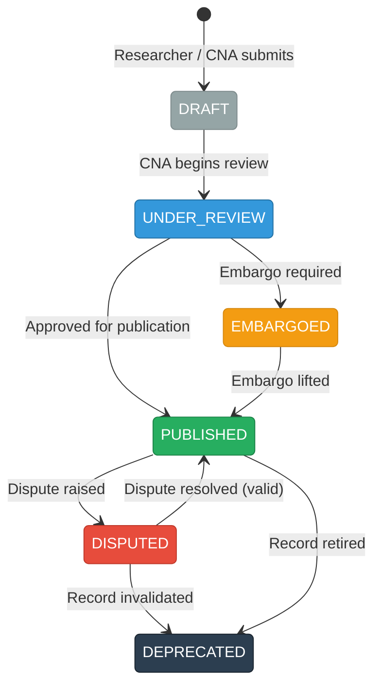

### 5.6 Features of New System

**Table 5.3    Comparison — Current System vs VulnChain**

| Feature | Current System (MITRE/NVD) | VulnChain (Proposed System) |
|---|---|---|
| Architecture | Centralized databases managed by single organizations, creating single points of failure. | Distributed blockchain ledger replicated across multiple organizations, eliminating single points of failure. |
| Authority Model | Hierarchical authority with MITRE at the top, making unilateral decisions about CVE assignment and publication. | Multi-organization consortium where decisions are made collectively through weighted governance voting. |
| Audit Trail | Database logs that can be modified or deleted by administrators, providing no independent verification capability. | Immutable blockchain records where every change is cryptographically chained, allowing any participant to verify the complete history. |
| Governance | No formal democratic mechanism for the 300+ CNAs to participate in policy decisions or dispute resolution. | Structured governance system with proposals, weighted voting, configurable quorum and threshold, and automatic resolution. |
| Transparency | Limited visibility into the decision-making process behind CVE state changes and severity assessments. | Full transaction transparency where every state transition is recorded with the identity and timestamp of the responsible party. |
| Data Integrity | Trust-based model where stakeholders must trust the central authority's database security practices. | Cryptographic verification model where blockchain consensus ensures that all participants agree on every record's state. |
| Access Control | Organization-level access managed informally through CNA agreements and web portal accounts. | Fine-grained five-tier RBAC enforced at three levels (frontend, backend middleware, and blockchain chaincode). |
| Vulnerability Lifecycle | Informal workflow that varies between CNAs, with no enforced state transitions or validation rules. | Formally defined six-state machine with enforced transitions, role-based authorization, and immutable transition logging. |
| Analytics | Available through separate NVD interfaces with limited customization and no real-time dashboard. | Integrated real-time analytics dashboard with severity distribution, status breakdown, trend analysis, and organizational statistics. |
| User Experience | Fragmented tools and interfaces across MITRE, NVD, and individual CNA portals. | Unified web platform with role-appropriate views, consistent dark theme, and streamlined workflows for all user types. |

---

## CHAPTER 6: SYSTEM DESIGN

### 6.1 System Architecture Diagram

VulnChain follows a three-tier architecture: the React frontend communicates via HTTPS/REST with the Node.js/Express backend, which connects to three data stores — Hyperledger Fabric (via gRPC through Fabric Gateway SDK) for immutable CVE and governance records across two channels, SQLite for off-chain user data, and Redis for caching.

[INSERT: Fig 6.1 — System Architecture Diagram. Generate using Mermaid code below:]

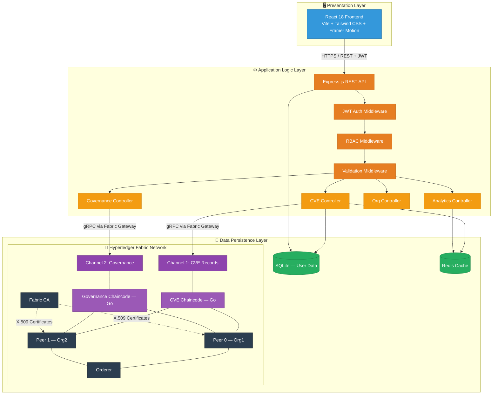

### 6.2 Use Case Diagram

The system has five actors — PUBLIC, RESEARCHER, CNA_MEMBER, NATIONAL_BODY, and ADMIN — along with the Blockchain Network as a system actor. Higher-privilege roles inherit the capabilities of lower ones.

[INSERT: Fig 6.2 — Use Case Diagram. Generate using Mermaid code below:]

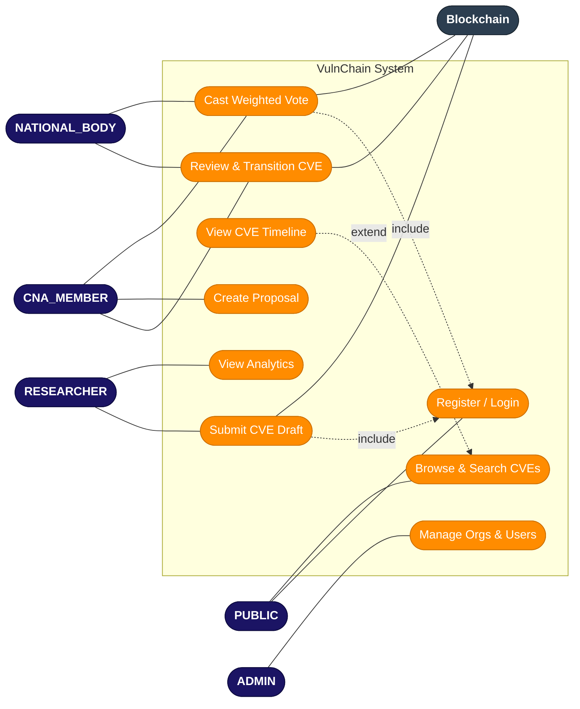

### 6.3 Class Diagram

The system has four primary entity classes: User (off-chain in SQLite), CVERecord (on-chain), GovernanceProposal (on-chain), and Vote (embedded in proposals). A User can submit multiple CVERecords, propose multiple GovernanceProposals, and cast one Vote per proposal. Each CVERecord contains HistoryEntry objects tracking state transitions.

[INSERT: Fig 6.3 — Class Diagram. Generate using Mermaid code below:]

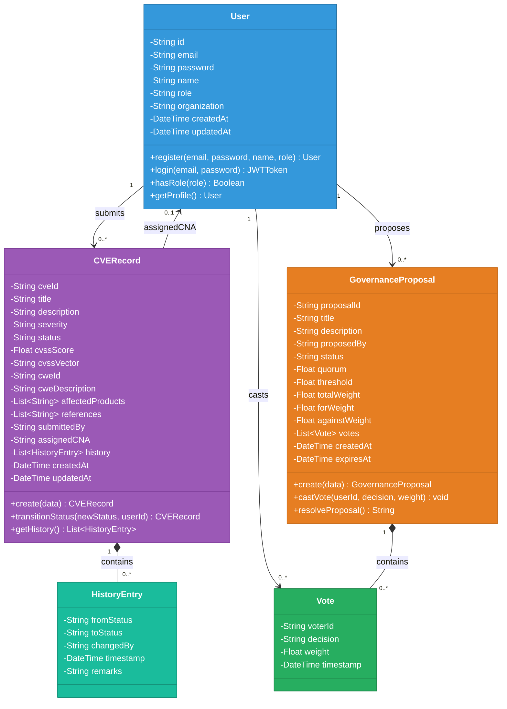

### 6.4 Sequence Diagram

**CVE Submission Flow:**

This diagram shows the end-to-end flow when a user submits a new CVE — from the frontend form through JWT/RBAC middleware validation, Fabric Gateway transaction submission, chaincode execution on endorsing peers, block commitment via orderer, cache invalidation, and finally the success response back to the user.

[INSERT: Fig 6.4 — Sequence Diagram — CVE Submission. Generate using Mermaid code below:]

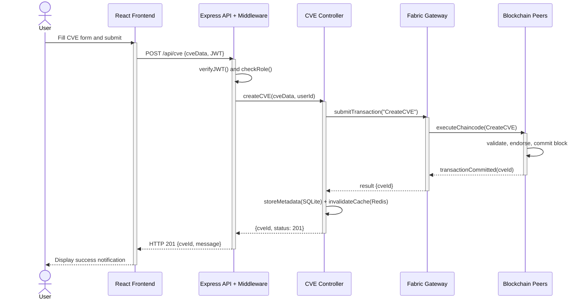

**Governance Voting Flow:**

This diagram shows the voting flow — the user casts a vote, the backend calculates role-based weight, the governance chaincode validates for duplicate votes, records the weighted vote, checks quorum/threshold conditions, and auto-resolves the proposal if conditions are met.

[INSERT: Fig 6.5 — Sequence Diagram — Governance Voting. Generate using Mermaid code below:]

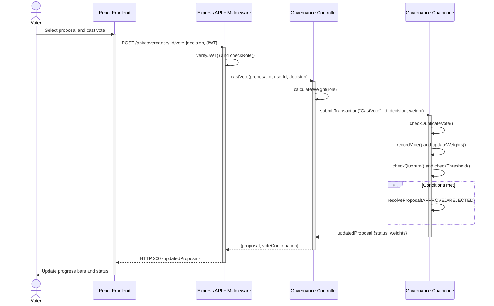

### 6.5 Activity Diagram

**CVE Lifecycle Activity:**

This diagram shows the complete CVE flow from vulnerability discovery through DRAFT, UNDER_REVIEW, optional EMBARGOED, PUBLISHED, and potential DISPUTED/DEPRECATED states, with decision points at each stage.

[INSERT: Fig 6.6 — Activity Diagram — CVE Lifecycle. Generate using Mermaid code below:]

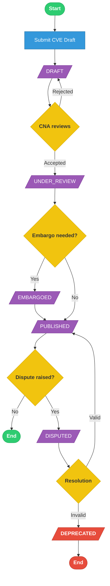

**Governance Process Activity:**

This diagram shows proposals moving from creation through weighted voting, quorum checking, threshold evaluation, and final resolution as APPROVED, REJECTED, or EXPIRED.

[INSERT: Fig 6.7 — Activity Diagram — Governance Process. Generate using Mermaid code below:]

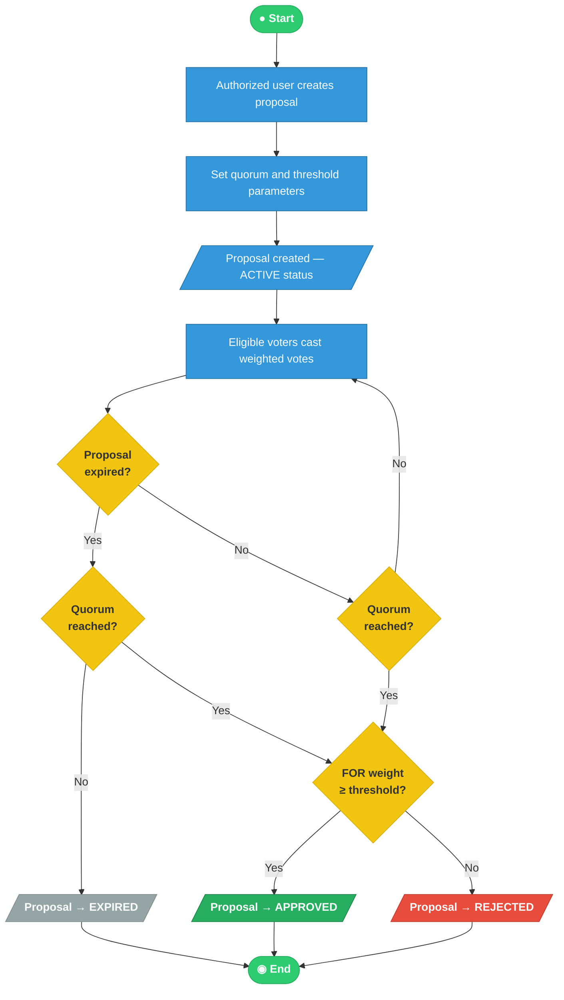

### 6.6 Data Flow Diagram

**Level-0 DFD (Context Diagram):**

The context diagram shows VulnChain as a central process interacting with five external entities: Security Researcher, CNA Member, National Body, Admin, and Public User, with data flows for CVE submissions, reviews, votes, queries, and responses.

[INSERT: Fig 6.8 — Level-0 DFD (Context Diagram). Generate using Mermaid code below:]

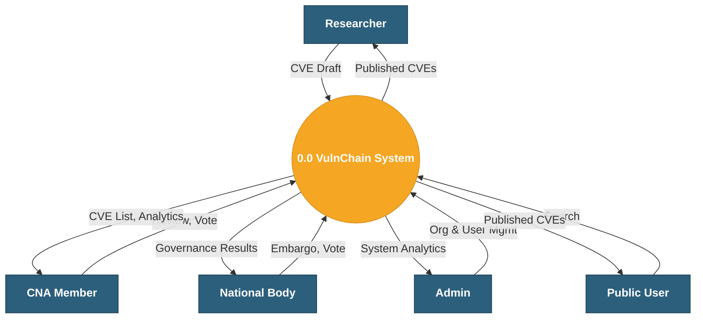

**Level-1 DFD:**

The Level-1 DFD decomposes the system into five processes — Authentication (1.0), CVE Management (2.0), Governance (3.0), Analytics (4.0), and Organization Management (5.0) — with four data stores: User Database (D1-SQLite), Blockchain Ledger (D2-Fabric), Cache (D3-Redis), and Fabric CA (D4).

[INSERT: Fig 6.9 — Level-1 DFD. Generate using Mermaid code below:]

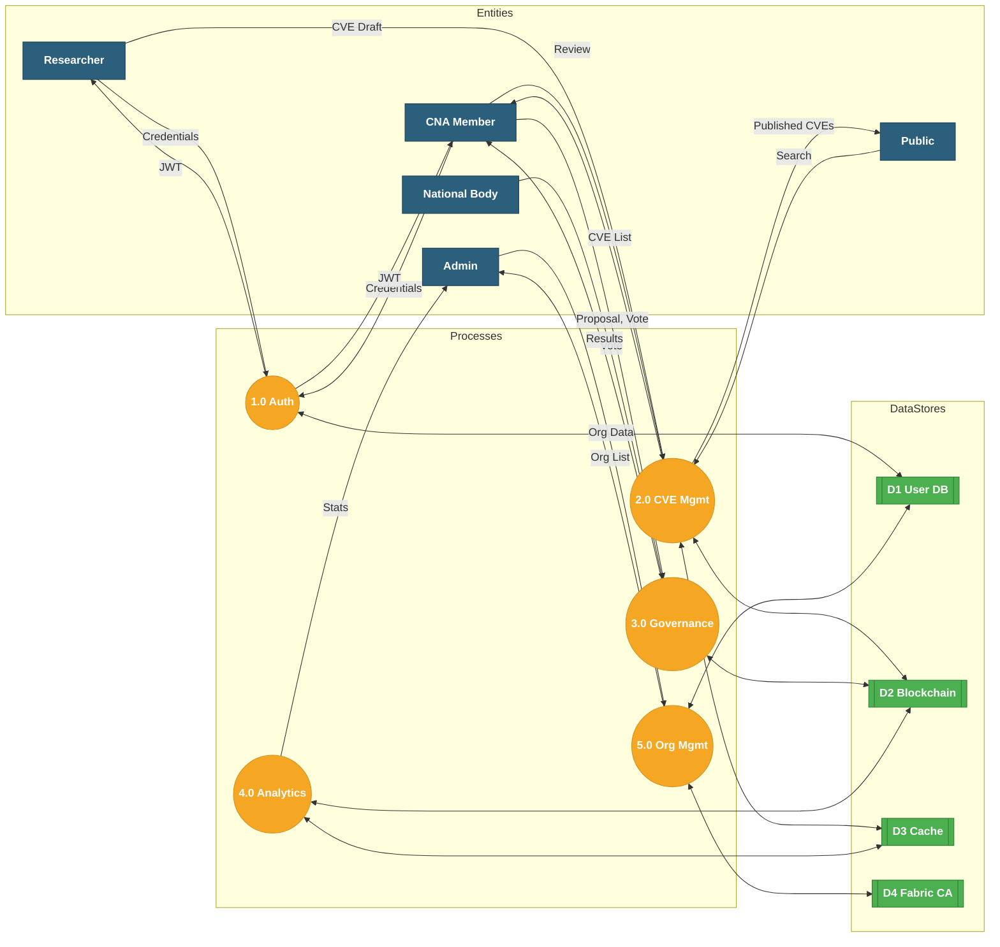

### 6.7 ER Diagram

The data model spans two storage systems — SQLite (off-chain) for User data and Hyperledger Fabric (on-chain) for CVE and governance records. The User entity has a UUID primary key referenced by all blockchain entities. CVERecord contains an embedded HistoryEntry array for state transition tracking. GovernanceProposal contains an embedded Vote collection. HISTORY_ENTRY and VOTE are weak entities. Complete attribute specifications with data types and constraints are detailed in Section 6.8.

[INSERT: Fig 6.10 — ER Diagram. Generate using Mermaid code below:]

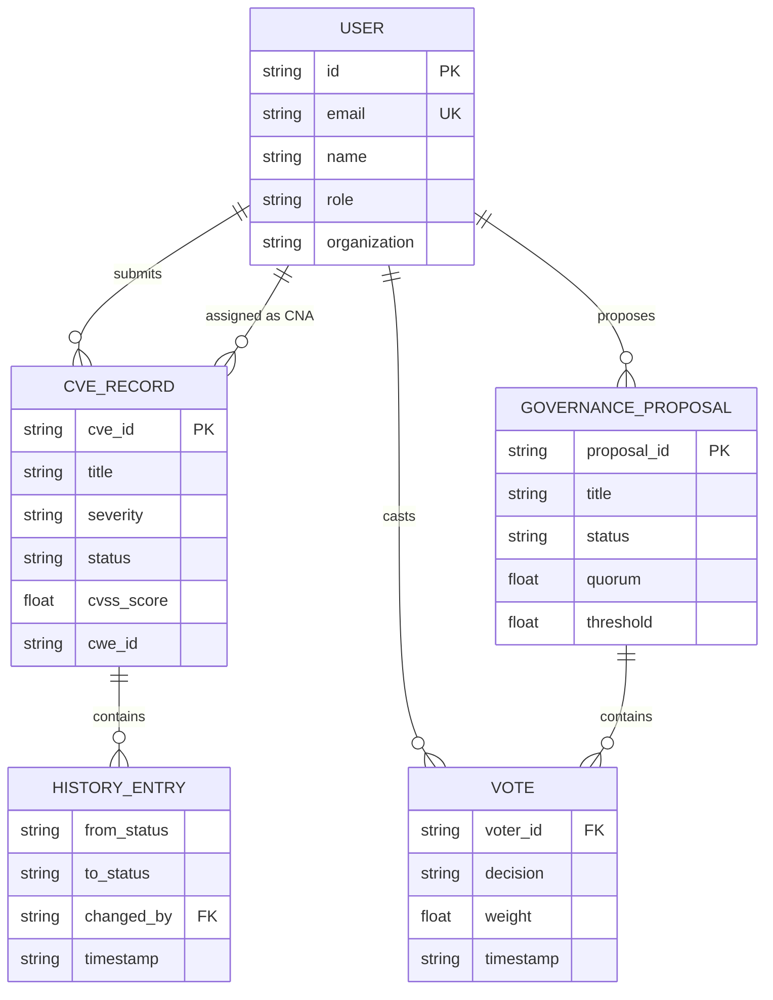

### 6.8 Database Design

VulnChain uses a hybrid storage approach — SQLite for off-chain user data (fast authentication without blockchain overhead) and Hyperledger Fabric ledger for CVE records and governance proposals (immutability and distributed replication). Each record on the blockchain is stored as a JSON document in the Fabric world state, keyed by its unique identifier.

**Table 6.1    User Table Schema (SQLite — Off-Chain)**

| Column | Type | Constraints | Description |
|---|---|---|---|
| id | TEXT | PRIMARY KEY | UUID v4, used as identifier across all components including blockchain transactions |
| email | TEXT | UNIQUE, NOT NULL | Login credential with database-level uniqueness enforcement |
| password | TEXT | NOT NULL | bcrypt-hashed (cost factor 10), plain text never stored |
| name | TEXT | NOT NULL | Display name shown on CVE submissions and governance votes |
| role | TEXT | NOT NULL, CHECK | ADMIN, CNA_MEMBER, NATIONAL_BODY, RESEARCHER, or PUBLIC |
| organization | TEXT | NULLABLE | Maps to a Fabric network organization |
| created_at | TEXT | DEFAULT CURRENT_TIMESTAMP | Account creation timestamp |
| updated_at | TEXT | DEFAULT CURRENT_TIMESTAMP | Last modification timestamp |

**Table 6.2    CVE Record Structure (Blockchain — On-Chain)**

| Field | Type | Description |
|---|---|---|
| cveId | string | Unique identifier (CVE-YEAR-NNNNN format), world state key |
| title | string | Vulnerability title |
| description | string | Detailed technical description |
| severity | string | NONE, LOW, MEDIUM, HIGH, or CRITICAL |
| status | string | Lifecycle state — controlled exclusively through chaincode transitions |
| cvssScore | float | Optional preliminary CVSS v3.1 base score (0.0–10.0) |
| cvssVector | string | Optional CVSS vector string |
| cweId | string | CWE identifier (e.g., CWE-79) |
| cweDescription | string | Weakness type description |
| affectedProducts | []string | Affected software/hardware list |
| references | []string | Advisory and patch URLs |
| submittedBy | string | Submitter's User ID |
| assignedCNA | string | Assigned CNA's User ID |
| history | []HistoryEntry | State transition audit log |
| createdAt / updatedAt | string | ISO 8601 timestamps |

**Table 6.3    Governance Proposal Structure (Blockchain — On-Chain)**

| Field | Type | Description |
|---|---|---|
| proposalId | string | UUID, world state key |
| title / description | string | Proposal content |
| proposedBy | string | Creator's User ID |
| status | string | ACTIVE, APPROVED, REJECTED, or EXPIRED |
| quorum | float | Minimum participation percentage (0.0–1.0) |
| threshold | float | Minimum approval percentage (0.0–1.0) |
| votes | []Vote | Array of {voterId, decision, weight, timestamp} |
| totalWeight / forWeight / againstWeight | float | Running vote weight sums |
| createdAt / expiresAt | string | Proposal lifecycle timestamps |

### 6.9 Access Control and Security

VulnChain implements defense-in-depth through three layers of access control — frontend (ProtectedRoute component with role-based conditional rendering), backend (JWT auth middleware + RBAC middleware rejecting unauthorized requests with 401/403), and blockchain (Fabric MSP with X.509 certificate verification + chaincode-level validation).

**Table 6.4    Role-Based Access Control Matrix**

| Feature | PUBLIC | RESEARCHER | CNA_MEMBER | NATIONAL_BODY | ADMIN |
|---|---|---|---|---|---|
| View Published CVEs | Yes | Yes | Yes | Yes | Yes |
| View All CVE States | No | No | Yes | Yes | Yes |
| Submit CVE Draft | No | Yes | Yes | No | Yes |
| Review CVE Details | No | No | Yes | Yes | Yes |
| Transition CVE State | No | No | Yes | Yes | Yes |
| Create Governance Proposal | No | No | Yes | Yes | Yes |
| Cast Governance Vote | No | No | Yes (standard weight) | Yes (elevated weight) | Yes (standard weight) |
| View Analytics Dashboard | No | Yes (limited) | Yes (full) | Yes (full) | Yes (full) |
| Manage Organizations | No | No | No | No | Yes |
| Manage User Accounts | No | No | No | No | Yes |

Additional security measures include bcrypt password hashing (cost factor 10), Helmet middleware for HTTP security headers (CSP, X-Frame-Options, HSTS), express-validator for input sanitization, and CORS restricting API access to the frontend domain only.

---

## CHAPTER 7: IMPLEMENTATION

### 7.1 Implementation Environment

The development environment runs on Ubuntu 22.04 LTS. The frontend uses Vite's dev server with hot module replacement for rapid UI iteration, while the backend runs under Nodemon for auto-restart on code changes. The blockchain layer runs as Docker containers managed through Docker Compose — including peer nodes, orderer, certificate authority, and CouchDB instances. SQLite operates as a serverless file-based database requiring no separate process, and Redis runs as a standalone caching server.

For production deployment, the system is designed for Kubernetes clusters using Hyperledger Bevel. Bevel's Ansible playbooks and Helm charts automate the provisioning of Fabric peers, orderers, and CAs across multiple namespaces, while the backend and frontend deploy as standard Kubernetes deployments with ingress controllers.

### 7.2 Module Description

The system is organized into three modules, each handling a distinct layer of the platform.

**Blockchain Module** consists of two Go smart contracts deployed on separate Fabric channels. The CVE contract validates incoming data, generates unique CVE IDs, initializes records with DRAFT status, enforces the six-state lifecycle machine for all transitions, and maintains a history array documenting every change. The governance contract manages proposal creation with quorum/threshold parameters, prevents duplicate votes, records weighted votes, tracks running totals, and auto-resolves proposals when conditions are met. Supporting modules handle Go struct definitions and utility functions.

**Backend Module** is built on Node.js/Express and acts as the bridge between the frontend and blockchain. It handles user registration and login with bcrypt password hashing and JWT token generation. For CVE operations, it translates REST requests into Fabric Gateway SDK transactions, applies role-based filtering on query results (e.g., PUBLIC users see only PUBLISHED records), and manages Redis cache with invalidation on writes. The governance controller adds vote weight calculation based on user roles before submitting to chaincode. The analytics module aggregates blockchain data into statistical summaries with longer cache TTL values for performance.

**Frontend Module** is a React single-page application with role-adaptive views. Authentication state is managed through React Context with JWT storage, decoding, and automatic attachment via Axios interceptors. The landing page features an animated matrix rain background. The dashboard shows KPI cards, recent CVEs, quick actions, and activity feed. CVE pages provide list/detail/submission views with dynamic state transition buttons. Governance pages display proposals as cards with vote progress bars and voting panels. Analytics renders severity, status, trend, and organization charts using Recharts.

### 7.3 Coding Standards

➤ **JavaScript/React:** ES2020+ syntax, functional components with hooks, PascalCase for components, camelCase for utilities, Tailwind CSS utility classes for styling.

➤ **Go Chaincode:** Standard gofmt formatting, PascalCase for exports, explicit error returns, JSON struct tags for world state marshaling.

➤ **API Design:** RESTful conventions with noun-based URLs, appropriate HTTP methods, consistent JSON response structures, and standard HTTP status codes.

### 7.4 Screenshots

[INSERT: Fig 7.1 — Screenshot — Landing Page]
*The VulnChain landing page features an animated matrix rain background with green cascading characters on a deep black canvas. The hero section displays the VulnChain shield+chain logo with the tagline "Decentralized CVE Management on Blockchain." A feature highlights section shows four cards describing key capabilities: Immutable Records, Weighted Governance, Role-Based Access, and Real-Time Analytics. Login and Register buttons are prominently displayed in matrix green.*

[INSERT: Fig 7.2 — Screenshot — Login Page]
*The login form presents a clean, centered card on the dark background with email and password input fields styled with matrix green border accents. A submit button in matrix green and a link to the registration page appear below the fields. The VulnChain logo is displayed above the form.*

[INSERT: Fig 7.3 — Screenshot — Dashboard]
*The main dashboard shows four KPI cards at the top displaying Total CVEs, Critical CVEs, Active Proposals, and Organizations with animated counter numbers. Below, the left section contains a Recent CVE Table with severity and status badges, the center shows Quick Actions with role-appropriate shortcut buttons, and the right side displays an Activity Feed with recent system events. The collapsible sidebar navigation is visible on the left.*

[INSERT: Fig 7.4 — Screenshot — CVE List Page]
*A paginated table displays CVE records with columns for CVE ID, Title, Severity (color-coded badges — green for LOW, yellow for MEDIUM, orange for HIGH, red for CRITICAL), Status (distinct colored badges for each lifecycle state), Submitted By, and Date. The filter panel on the left allows filtering by severity level, status, and date range. A search bar at the top supports keyword search.*

[INSERT: Fig 7.5 — Screenshot — CVE Detail Page]
*The detail view shows comprehensive vulnerability information organized in an info grid: title, description, severity and status badges, CVSS score and vector, CWE identification, affected products list, and reference links. A visual timeline on the right side displays the chronological history of state transitions with timestamps and responsible user names. State transition buttons at the bottom show only valid transitions for the current user's role.*

[INSERT: Fig 7.6 — Screenshot — CVE Submit Form]
*The multi-section submission form shows organized input areas: Basic Information (title and description fields), Severity Assessment (dropdown selector with helper text), CVSS Data (optional score and vector fields with an info box explaining NIST/NVD's role), Classification (CWE ID and description), Affected Products (dynamic list with add/remove buttons), and References (dynamic URL list). All form elements follow the dark theme with matrix green accents.*

[INSERT: Fig 7.7 — Screenshot — Governance Page]
*Governance proposals are displayed as cards showing the title, status badge (ACTIVE in green, APPROVED in blue, REJECTED in red), proposer name, creation date, and a visual progress bar showing FOR vs AGAINST vote percentages with the current quorum percentage. A "Create Proposal" button appears for authorized users.*

[INSERT: Fig 7.8 — Screenshot — Governance Detail Page]
*The detailed proposal view shows the full description text, a vote summary section with progress bars for quorum achievement and approval percentage, a vote history table listing each voter's name, decision (FOR/AGAINST/ABSTAIN with colored badges), weight, and timestamp, and the voting panel where eligible users can select their decision and cast their vote.*

[INSERT: Fig 7.9 — Screenshot — Analytics Page]
*The analytics dashboard displays four visualization panels: a bar chart showing CVE counts across severity levels (NONE through CRITICAL) with severity-appropriate colors, a pie chart showing the distribution across lifecycle states, a line chart showing CVE submission trends over time with matrix green line color, and an organization statistics table. All charts use the dark theme with light-colored labels and green accents.*

---

## CHAPTER 8: TESTING

### 8.1 Testing Plan

The VulnChain testing strategy was designed to validate the system's correctness, security, and reliability across all three architectural layers — from individual chaincode functions to complete end-to-end user workflows.

Testing was organized into four levels. Unit testing focused on individual functions within the chaincode (state machine validation, vote weight calculation, quorum checking), backend controllers (data transformation, error handling), and frontend components (rendering behavior, state management). Integration testing validated the interactions between layers — ensuring that API requests correctly translate to chaincode invocations and that blockchain responses are properly transformed for frontend consumption. End-to-end testing verified complete user workflows by exercising the full stack from browser interaction through API processing to blockchain commitment and back. Security testing specifically targeted authentication bypass attempts, role escalation vulnerabilities, and input validation effectiveness.

### 8.2 Testing Strategy

| Testing Level | Scope | Approach | Focus Areas |
|---|---|---|---|
| Unit Testing | Individual chaincode functions, controller methods, React component rendering | Go testing framework for chaincode; manual function-level testing with Postman for API; browser developer tools for React components | State machine transition validation, vote weight calculation correctness, password hashing verification, component conditional rendering based on roles |
| Integration Testing | API-to-blockchain communication, authentication flow, cache synchronization | Postman collections executing sequential API calls that depend on previous results (register → login → submit CVE → transition state) | Data consistency between API responses and blockchain state, cache invalidation after write operations, JWT token flow across endpoints |
| End-to-End Testing | Complete user workflows spanning frontend, backend, and blockchain | Manual browser-based testing following defined user scenarios for each role type | Full CVE lifecycle from submission through publication, governance proposal from creation through resolution, analytics data accuracy after operations |
| Security Testing | Authentication, authorization, input validation boundaries | Attempted access to protected endpoints without tokens, with expired tokens, and with tokens of insufficient role; submission of malformed and potentially malicious input data | JWT verification robustness, RBAC enforcement at both API and chaincode levels, XSS prevention through input sanitization, CORS policy enforcement |

### 8.3 Test Cases

**Table 8.1    Test Cases — Authentication Module**

| Test ID | Test Condition | Input | Expected Output | Actual Output | Status |
|---|---|---|---|---|---|
| TC-A01 | Successful user registration with valid data | Email: test@example.com, Password: SecureP@ss1, Name: Test User, Role: RESEARCHER | HTTP 201, JWT token returned with correct role claim, user stored in SQLite | JWT token returned, user record created with hashed password | PASS |
| TC-A02 | Registration rejected for duplicate email | Same email as existing user with different password and name | HTTP 400, error message indicating email already exists, no duplicate record created | "Email already registered" error returned | PASS |
| TC-A03 | Successful login with correct credentials | Email and password matching an existing account | HTTP 200, fresh JWT token returned with correct user claims (id, role, organization) | Token generated with 24-hour expiration | PASS |
| TC-A04 | Login rejected for incorrect password | Valid email with wrong password | HTTP 401, generic error message (not revealing whether email exists), no token issued | "Invalid credentials" error returned | PASS |
| TC-A05 | Protected endpoint accessed without JWT token | GET /api/cve with no Authorization header | HTTP 401, request rejected before reaching controller logic | "No token provided" error returned | PASS |
| TC-A06 | Protected endpoint accessed with expired JWT | Valid format token that has passed its expiration time | HTTP 401, token rejected during middleware verification, user redirected to login on frontend | "Token expired" error, frontend clears stored token | PASS |
| TC-A07 | Admin endpoint accessed by RESEARCHER role | GET /api/org with valid RESEARCHER JWT | HTTP 403, RBAC middleware rejects request, no organization data exposed | "Insufficient permissions" error returned | PASS |

**Table 8.2    Test Cases — CVE Management Module**

| Test ID | Test Condition | Input | Expected Output | Actual Output | Status |
|---|---|---|---|---|---|
| TC-C01 | CVE draft submission by authorized CNA member | Valid CVE data (title, description, severity: HIGH, affected products, references) with CNA_MEMBER JWT | HTTP 201, unique CVE ID returned, record created on blockchain with DRAFT status and submitter recorded | CVE-2026-XXXX ID generated, blockchain transaction committed | PASS |
| TC-C02 | CVE submission rejected for unauthorized PUBLIC role | Same valid CVE data but with PUBLIC user JWT | HTTP 403, submission blocked by RBAC middleware before reaching chaincode | "Insufficient permissions" error, no blockchain transaction submitted | PASS |
| TC-C03 | CVE list retrieval as ADMIN showing all records | GET /api/cve with ADMIN JWT | HTTP 200, complete list of all CVE records across all statuses returned, including DRAFT and EMBARGOED | All 44 CVE records returned with correct severity and status data | PASS |
| TC-C04 | CVE list retrieval as PUBLIC showing only published | GET /api/cve with PUBLIC JWT | HTTP 200, only CVE records with PUBLISHED status returned, all other statuses filtered out | Filtered list returned containing only PUBLISHED records | PASS |
| TC-C05 | Valid state transition from DRAFT to UNDER_REVIEW | PUT /api/cve/:id/status with newStatus: UNDER_REVIEW, CNA_MEMBER JWT | HTTP 200, status updated on blockchain, new history entry created with transition details and timestamp | Status changed, history entry records CNA member as performer | PASS |
| TC-C06 | Invalid state transition from DRAFT directly to PUBLISHED | PUT /api/cve/:id/status with newStatus: PUBLISHED for a DRAFT CVE | HTTP 400, chaincode rejects invalid transition, CVE remains in DRAFT status | "Invalid state transition" error, record unchanged on ledger | PASS |
| TC-C07 | CVE detail retrieval with complete timeline | GET /api/cve/:id for a CVE with multiple state transitions | HTTP 200, full CVE data returned with history array containing all transitions in chronological order | Complete record with 3 history entries showing DRAFT→UNDER_REVIEW→PUBLISHED | PASS |
| TC-C08 | CVE search filtered by CRITICAL severity | GET /api/cve?severity=CRITICAL | HTTP 200, only CVE records with CRITICAL severity returned, other severities excluded | Correct filtered subset returned | PASS |

**Table 8.3    Test Cases — Governance Module**

| Test ID | Test Condition | Input | Expected Output | Actual Output | Status |
|---|---|---|---|---|---|
| TC-G01 | Proposal creation by authorized CNA member | Title, description, quorum: 0.51, threshold: 0.66 with CNA_MEMBER JWT | HTTP 201, proposal created on governance channel with ACTIVE status, unique proposal ID returned | Proposal committed to blockchain with specified parameters | PASS |
| TC-G02 | Proposal creation rejected for RESEARCHER role | Same valid proposal data but with RESEARCHER JWT | HTTP 403, RBAC middleware blocks request, no blockchain transaction | "Insufficient permissions" error returned | PASS |
| TC-G03 | Successful FOR vote with correct weight calculation | POST /api/governance/:id/vote with decision: FOR, CNA_MEMBER JWT | HTTP 200, vote recorded with CNA_MEMBER weight, running totals updated on blockchain | Vote weight correctly calculated, forWeight incremented | PASS |
| TC-G04 | Duplicate vote prevented from same user | Same user attempts to vote again on the same proposal | HTTP 400, chaincode detects existing vote from this voter ID and rejects transaction | "Already voted on this proposal" error returned | PASS |
| TC-G05 | Proposal auto-approved when quorum and threshold met | Multiple FOR votes bringing total weight above quorum and FOR percentage above threshold | Proposal status automatically transitions from ACTIVE to APPROVED on blockchain | Status changed to APPROVED, accessible via API immediately | PASS |
| TC-G06 | Proposal rejected when threshold not met despite quorum | Majority AGAINST votes with total weight above quorum but FOR percentage below threshold | Proposal status transitions to REJECTED | Status changed to REJECTED with vote breakdown preserved | PASS |
| TC-G07 | Governance detail with complete vote breakdown | GET /api/governance/:id for a resolved proposal | HTTP 200, full proposal data with all votes listing voter names, decisions, weights, and timestamps | Complete vote history returned with calculated percentages | PASS |

---

## CHAPTER 9: CONCLUSION AND DISCUSSION

### 9.1 Self Analysis of Project Viabilities

➤ **Technical Viability:** The Fabric network reliably processes CVE transactions within acceptable timeframes. The two-channel architecture effectively segregates data, the Go chaincode correctly enforces the state machine (rejecting all invalid transitions during testing), and the Fabric Gateway SDK integration with Node.js maintains stable gRPC connections.

➤ **Operational Viability:** During informal usability evaluation, users navigated the platform, submitted CVEs, and cast governance votes without requiring blockchain knowledge — the web interface fully abstracts the underlying complexity. The Redis caching layer significantly improves read performance over direct blockchain queries.

➤ **Security Viability:** The three-layer access control (frontend, backend, chaincode) proved robust — no authorization bypass was achieved during testing. Every attempt to access restricted functionality without appropriate credentials was blocked at one or more layers.

### 9.2 Problems Encountered and Possible Solutions

Several significant challenges were encountered during development, each requiring investigation and creative problem-solving.

➤ **Hyperledger Fabric Network Configuration Complexity:** Setting up a multi-organization Fabric network involves numerous interdependent configuration files for peers, orderers, certificate authorities, channels, and chaincode. Initial setup attempts resulted in certificate mismatches, channel creation failures, and peer communication errors. This was resolved by adopting Hyperledger Bevel for automated network provisioning and using Docker Compose for local development environments, which reduced manual configuration errors significantly.

➤ **API Response Format Mismatch:** After completing the frontend, the CVE list page showed a count of 44 records but displayed none. Investigation revealed that the backend API returns CVE data wrapped in a JSON object (such as `{ cves: [...] }`) while the frontend was expecting a raw array. This was a classic integration issue that arose because the frontend and backend were developed in separate phases. The fix involved adding response extraction logic in the frontend service layer to handle both wrapped and raw response formats.

➤ **Dark Theme Rendering in Third-Party Libraries:** The Recharts charting library and native HTML select elements did not automatically respect the application's dark theme. Chart tooltips and legends rendered with black text on dark backgrounds, making them unreadable, and dropdown menus used the operating system's default light styling. These issues were resolved by applying custom style configurations to Recharts components (content styles, label styles, and legend formatters) and adding the CSS `color-scheme: dark` property for native form elements.

➤ **Pie Chart Including Aggregate Data:** The analytics pie chart displayed a "total" slice alongside the actual status categories because the backend's status count response included a `total` field alongside individual status counts. This was fixed by filtering out the `total` key in the frontend before passing data to the chart component.

➤ **Blockchain Transaction Latency for Read Operations:** Querying the blockchain directly for every CVE list request resulted in noticeable latency, especially as the number of records grew. The Redis caching layer was implemented to address this, with configurable TTL values tuned to balance data freshness against query performance.

### 9.3 Summary of Project Work

VulnChain successfully delivers a fully functional decentralized CVE management platform that meets all objectives outlined in Section 1.3. The three-layer architecture described in Chapter 6 — Hyperledger Fabric blockchain, Node.js REST API, and React frontend — has been implemented, integrated, and tested end-to-end with over 44 CVE records, multiple governance proposals, and users across all five role types. The platform demonstrates that permissioned blockchain technology can meaningfully improve transparency, accountability, and collaboration in vulnerability management without sacrificing usability or performance.

### 9.4 Limitation and Future Enhancement

**Current Limitations:**

In addition to the scope exclusions listed in Section 1.4 (no NVD/MITRE integration, no automated CVSS calculator, no push notifications, no native mobile app), the following operational limitations were identified during development:

➤ The system has been developed and tested in a local/development environment. While the architecture supports production deployment on multi-cloud Kubernetes clusters through Bevel, a full production deployment with geographically distributed organizations has not been executed and may reveal additional scalability or latency challenges.

➤ The current implementation has been tested with a moderate data volume (tens of records). Performance characteristics at scale (tens of thousands of CVE records, hundreds of concurrent users) have not been benchmarked.

**Future Enhancements:**

➤ **NVD/MITRE API Integration:** Building automated synchronization with the National Vulnerability Database and MITRE's CVE Services would allow VulnChain to import existing CVE data, cross-reference records, and export locally managed CVEs to the global CVE ecosystem, bridging the gap between the decentralized and centralized approaches.

➤ **Automated CVSS Calculator:** Implementing an interactive CVSS v3.1 calculator within the CVE submission form, where users select individual metric values and the system computes the base score and vector string automatically, would improve data quality and reduce user error.

➤ **Real-Time Notification System:** Adding push notifications through WebSocket connections, email alerts, and webhook callbacks would ensure stakeholders are immediately informed of important events such as new critical CVE publications, state transitions on CVEs they are tracking, and governance proposal results.

➤ **AI-Powered Analysis:** Integrating machine learning models could enable automated duplicate detection (identifying when a newly submitted CVE describes a vulnerability already cataloged under a different ID), severity prediction (suggesting CVSS scores based on vulnerability descriptions), and trend forecasting (predicting future vulnerability volumes by technology category).

➤ **Mobile Application:** Developing a React Native companion application for iOS and Android would allow security professionals to monitor vulnerability feeds, receive push notifications, and cast governance votes from mobile devices during incidents or travel.

➤ **SBOM (Software Bill of Materials) Integration:** Connecting VulnChain with SBOM tools would enable automatic identification of which organizations and products are affected by newly published CVEs, based on their declared software dependencies.

---

## REFERENCES

[1] Androulaki E., Barger A., Bortnikov V., Cachin C., Christidis K., De Caro A., Enyeart D., Ferris C., Laventman G., Manevich Y., Muralidharan S., Murthy C., Nguyen B., Sethi M., Singh G., Smith K., Sorniotti A., Stathakopoulou C., Vukolic M., Cocco S.W., Yellick J. (2018) "Hyperledger Fabric: A Distributed Operating System for Permissioned Blockchains," *Proceedings of the Thirteenth EuroSys Conference*, ACM, Porto, Portugal.

[2] Alexopoulos N., Dauber E., Antonakakis M., Polychronakis M. (2019) "Beyond Blacklists: A Blockchain-Based Decentralized Threat Intelligence Sharing Platform," *IEEE Security and Privacy on the Blockchain Workshop*, pp. 1-6.

[3] CVE Program (2024) "Common Vulnerabilities and Exposures — About," MITRE Corporation, Available at: https://www.cve.org/About/Overview

[4] First.org (2019) "Common Vulnerability Scoring System v3.1: Specification Document," Forum of Incident Response and Security Teams.

[5] Hyperledger Foundation (2024) "Hyperledger Fabric Documentation v2.5," The Linux Foundation, Available at: https://hyperledger-fabric.readthedocs.io/en/release-2.5/

[6] Hyperledger Foundation (2024) "Hyperledger Bevel — Blockchain Automation Framework," The Linux Foundation, Available at: https://hyperledger-bevel.readthedocs.io/

[7] MITRE Corporation (2024) "CWE — Common Weakness Enumeration," Available at: https://cwe.mitre.org/

[8] Nakamoto S. (2008) "Bitcoin: A Peer-to-Peer Electronic Cash System," Available at: https://bitcoin.org/bitcoin.pdf

[9] NIST (2024) "National Vulnerability Database," National Institute of Standards and Technology, Available at: https://nvd.nist.gov/

[10] Ølnes S., Ubacht J., Janssen M. (2017) "Blockchain in Government: Benefits and Implications of Distributed Ledger Technology for Information Sharing," *Government Information Quarterly*, Vol. 34, Issue 3, pp. 355-364, Elsevier.

---

## BIBLIOGRAPHY

[1] Dhillon V., Metcalf D., Hooper M. (2021) *Blockchain Enabled Applications: Understand the Blockchain Ecosystem and How to Make It Work for You*, 2nd Edition, Apress, Berkeley, CA.

[2] Gaur N., Desrosiers L., Novotny P., Ramakrishna V., O'Dowd A., Baez S. (2018) *Hands-On Blockchain with Hyperledger: Building Decentralized Applications with Hyperledger Fabric and Composer*, Packt Publishing.

[3] Stallings W. (2019) *Effective Cybersecurity: A Guide to Using Best Practices and Standards*, Addison-Wesley Professional.

[4] Tilkov S., Vinoski S. (2010) "Node.js: Using JavaScript to Build High-Performance Network Programs," *IEEE Internet Computing*, Vol. 14, No. 6, pp. 80-83.

[5] Banks A., Porcello E. (2020) *Learning React: Modern Patterns for Developing React Apps*, 2nd Edition, O'Reilly Media.

---

### FORMATTING NOTES FOR DOCX CONVERSION:

1. **Page Setup:** A4 paper, Margins: Left 1.25", Right 1.0", Top 1.0", Bottom 1.0"
2. **Header:** Top-left: Project ID (e.g., PRJ2026DCE0XX), Top-right: Chapter heading
3. **Footer:** Bottom-left: DEPSTAR, Bottom-center: Page number, Bottom-right: Department of Computer Engineering
4. **Chapter Headings:** Times New Roman 16pt, bold, ALL CAPITALS
5. **Section Headings:** Times New Roman 14pt, bold, ALL CAPITALS
6. **Subsection Headings:** Times New Roman 12pt, bold, Leading Capitals
7. **Regular Text:** Times New Roman 12pt, normal
8. **Line Spacing:** 1.5 between regular text lines; double between paragraphs/headings/figures
9. **Single Spacing:** For bullet points and listings
10. **Alignment:** Fully justified
11. **Page Numbering:** Roman numerals (i, ii, iii...) from Candidate's Declaration to before Chapter 1; Arabic numerals (1, 2, 3...) from Chapter 1 onwards
12. **Figures:** Numbered as Fig [Chapter].[Serial] — centered caption below
13. **Tables:** Numbered as Table [Chapter].[Serial] — centered caption above
14. **Bullet Points:** Use ➤ arrow symbol
15. **Mermaid diagrams:** Generate using draw.io (Extras > Edit Diagram > paste Mermaid) or https://mermaid.live then export as PNG/SVG
16. **Straight lines in draw.io:** After importing Mermaid, select all edges (Edit > Select Edges) → right-click → Edit Style → change `curved=1` to `curved=0` for straight connectors
17. **All [INSERT: ...] placeholders:** Paste screenshots or generated diagrams at those locations
